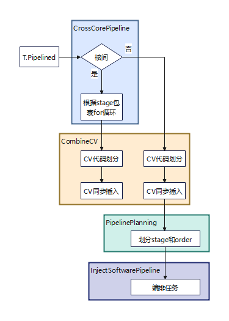

## 概述

`T.Pipelined` 是 TileLang-Ascend 中的流水线并行原语。在昇腾 NPU 上，流水线存在核内、核间两个层次，由编译器自动识别前端原语使用时属于哪个层次：

| 层次 | 掩盖对象 | 触发条件 | 对应 Pass |
|------|---------|---------|-----------|
| **核间流水** | Cube 核与 Vector 核间 | 循环体内同时含 Cube + Vector 操作 | `CrossCorePipeline` |
| **核内流水** | 单核内搬运与计算间 | 循环体内仅含单一核的操作 | `PipelinePlanning` + `InjectSoftwarePipeline` |

**使用约束：pipeline不能嵌套使用，核内和核间不能同时使用T.pipelined原语开启流水优化。**

---

## 接口

```python
for var in T.Pipelined(loop_iterations: int, num_stages: int, cross_interval: int = 1):
```

| 参数 | 类型 | 默认值 | 说明 |
|------|------|--------|------|
| `loop_iterations` | int | 必填 | 循环总迭代次数 |
| `num_stages` | int | 必填 | 流水线级数 |
| `cross_interval` | int | 1 | 跨核同步间隔（仅核间生效） |

---

## 两个层次的执行顺序与关系

### 判定逻辑

```
用户编写 T.Pipelined(loop_num, num_stages=N)
        ↓
CrossCorePipeline Pass 检测循环体
  ├─ 同时含 Cube + Vector → 命中核间, 处理后跳过核内
  └─ 仅含单一核操作       → 不处理, 交给核内 Pass
        ↓
PipelinePlanning + InjectSoftwarePipeline
  └─ 仅在核间未命中时执行
```

### Pass 执行顺序

```python
def OptimizeForTarget(mod: IRModule, target: Target) -> IRModule:
    mod = tir.transform.PlanAndUpdateBufferAllocationLocation()(mod)
    mod = tilelang.transform.CrossCorePipeline()(mod)          # 核间pipeline (先执行)
    mod = tilelang.transform.CombineCV()(mod)                   # CV代码划分
    mod = tilelang.transform.PipelinePlanning()(mod)            # 核内pipeline规划 (后执行)
    mod = tilelang.transform.InjectSoftwarePipeline()(mod)      # 核内流水注入
```



### 关系总结

```
T.Pipelined 注解
      │
      ├─→ 核间场景 ──→ CrossCorePipeline ──→ CombineCV ──→ AscendSyncInsert
      │    (Cube+Vector)    (拆分stage+      (CV划分+       (同步插入)
      │                     buffer扩展)      同步插入)
      │                                           ↘ 跳过核内pipeline ↗
      │
      └─→ 核内场景 ──→ CrossCorePipeline(跳过) ──→ CombineCV ──→ PipelinePlanning ──→ InjectSoftPipeline ──→ AscendSyncInsert
           (单一核)                                      (CV划分)   (分配stage/order)  (三段式生成)        (同步插入)
```

**核间优先，互斥执行：** CrossCorePipeline 先检测，命中则处理并使核内 Pass 跳过；未命中则由核内 Pass 处理。

---

## 两种场景的代码示例

### 核间流水线

循环体内混合 Cube 操作（gemm）和 Vector 操作（add），通过 workspace 传递数据：

```python
for i in T.Pipelined(cross_core_proc_num, num_stages=2):
    T.copy(Q[m_i, :], q_l1)
    T.gemm(q_l1, k_l1, acc_s_l0c)            # Cube
    T.copy(acc_s_l0c, workspace_1)
    T.copy(workspace_1, acc_s_ub_)
    T.add(acc_s_ub, acc_s_ub, acc_s_ub_)      # Vector
```

→ **CrossCorePipeline** 按 Cube/Vector scope 拆分 stage，扩展 workspace buffer 维度。

**详细设计见：** [pipeline_planning & Inject_pipeline_design.md](./references/pass-designs/pipeline_planning%20&%20inject_pipeline_design.md)

### 核内流水线

循环体内仅有单一核的搬运和计算操作：

```python
for k in T.Pipelined(loop_k, num_stages=2):
    T.copy(A[:, k*BLOCK_K], A_L1)            # CopyIn
    T.copy(B[k*BLOCK_K, :], B_L1)            # CopyIn
    T.gemm(A_L1, B_L1, C_L0)                 # Compute
```

→ **PipelinePlanning** 分配 stage/order → **InjectSoftwarePipeline** 生成 prologue/body/epilogue 三段式。

**详细设计见：** [pipeline_planning & inject_pipeline_design.md](./references/pass-designs/pipeline_planning%20&%20inject_pipeline_design.md)

---

## cross_interval 参数（仅核间）

```python
# cross_interval=1: 每次迭代同步（默认）
for k in T.Pipelined(num_iters, num_stages=4, cross_interval=1):

# cross_interval=2: 每2次迭代同步，减少同步开销
for k in T.Pipelined(num_iters, num_stages=4, cross_interval=2):
```

核内流水线中 `cross_interval` 参数无效。

---

## 编程模式约束

**支持：Flat Pattern**（推荐） — `T.Pipelined` 处理一种流水，另一种手动实现：

```python
for k in T.Pipelined(num_iters, num_stages=4):  # 核间
    for side in T.serial(2):                      # 手动核内 double buffering
        T.copy(K[side], k_l1)
        T.mma(l0a[side], l0b[side], l0c[side])
```

**不支持：Nested Pattern** — 两层 `T.Pipelined` 嵌套：

```python
for k in T.Pipelined(num_iters, num_stages=4):   # 核间
    for side in T.Pipelined(2, num_stages=2):      # 嵌套核内 ← 不支持
```

核间流水线需启用配置：

```python
pass_configs = {
    tilelang.PassConfigKey.TL_ASCEND_AUTO_CV_COMBINE: True,
    tilelang.PassConfigKey.TL_ASCEND_AUTO_CV_SYNC: True,
}
```

---

## 代码位置

| 功能 | 文件 | Pass 注册名 |
|------|------|------------|
| 核间流水线 | `src/transform/cross_core_pipeline.cc` | `tl.transform.CrossCorePipeline` |
| 核内流水线规划 | `src/transform/pipeline_planning.cc` | `tl.transform.PipelinePlanning` |
| 核内流水线注入 | `src/transform/inject_pipeline.cc` | `tl.transform.InjectSoftwarePipeline` |
| Python 前端 | `tilelang/language/ascend_tile.py` | `T.Pipelined` |