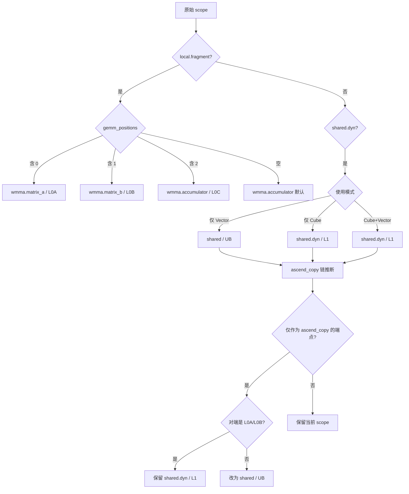

# AscendInferBufferScope Pass 设计文档

## 1. 背景与目标

### 1.1 需求来源

在 TileLang 前端，用户编写 Ascend 算子时使用统一的 `T.alloc_fragment` 与 `T.alloc_shared` 等抽象 API 申请片上 buffer。Ascend 后端代码生成阶段需要明确 buffer 落在哪一级物理存储上（L0A/L0B/L0C/L1/UB），否则 codegen 无法生成正确的搬运指令、寄存器声明和访问语义。`AscendInferBufferScope` 正是负责这一阶段的"buffer scope 二次推断"的 pass：基于 buffer 在 IR 中的实际使用模式（是否进入 `gemm/mma/matmul`、是否被 `tl.ascend_copy` 搬运、是否参与 vector 计算等），把抽象 scope 改写为具体的物理 scope。

### 1.2 业务价值

该 pass 解决以下核心痛点：

1. **前端易用性**：用户只需写 `T.alloc_fragment` / `T.alloc_shared`，无需手工标注 `wmma.matrix_a` / `wmma.matrix_b` / `wmma.accumulator` 等 Ascend 专有 scope。
2. **后端正确性**：把抽象 scope 收敛为具体物理 scope，使得后续 `LowerTileOp`、`AscendMemoryPlanning`、`AscendSyncInsert` 等 pass 能基于正确的存储级别做内存规划、地址映射和同步指令生成。

### 1.3 技术目标

1. **GEMM 角色识别**：根据 buffer 在 `gemm/mma/matmul` 函数调用中所处的参数位置，把 `local.fragment` 改写为 `wmma.matrix_a`（L0A）、`wmma.matrix_b`（L0B）或 `wmma.accumulator`（L0C）。
2. **L1 / UB 区分**：根据 buffer 是否参与 Cube（GEMM）或 Vector（逐元素）计算，把 `shared.dyn` 改写为 `shared.dyn`（L1）或 `shared`（UB）。
3. **ascend_copy 链推断**：对仅参与搬运、自身不直接进入 cube/vector 算子的 `shared.dyn` buffer，根据其在 `tl.ascend_copy` pair 中的对端 scope 进一步细化（例如对端是 L0A/B 则保持 L1，否则降级为 UB）。
4. **IR 全局重写**：把推断出的新 scope 同步反映到 `Allocate`、`Block.alloc_buffers`、`Var` 类型注解、`BufferLoad/Store` 和 `tvm_access_ptr` 中，保证 IR 内部一致性。

---

## 2. 整体设计

### 2.1 Pass 定位与触发

| 维度 | 说明 |
|------|------|
| 所属阶段 | Phase 1: LowerAndLegalize（IR Lowering 与合法化） |
| 执行时机 | 在 `InjectTmpBuffer` 之后、`AscendVidReduction` 之前 |
| 平台特性 | Ascend 专用 Pass |
| 启用方式 | 默认启用，无配置开关 |
| 注册名 | `tl.transform.InferAllocScope` |

`tilelang/engine/phase.py` 中的执行顺序：

```python
mod = tilelang.transform.InjectTmpBuffer(target)(mod)
mod = tilelang.transform.AscendInferBufferScope()(mod)   # ← 本 pass
mod = tilelang.transform.AscendVidReduction()(mod)
mod = tilelang.transform.BufferShapeCollector()(mod)
```

### 2.2 框架架构图

```
┌─────────────────────────────────────────────────────────────┐
│                  AscendInferBufferScope Pass                 │
├─────────────────────────────────────────────────────────────┤
│                                                              │
│  输入: PrimFunc (含 local.fragment / shared.dyn buffer)      │
│         ↓                                                    │
│  ┌─────────────────────────────────────────────┐            │
│  │  1. BufferUseCollector (StmtExprVisitor)    │            │
│  │     a. BuildHandleAllocMapping              │            │
│  │        → handle_var → BufferAllocationInfo  │            │
│  │     b. VisitExpr_(CallNode)                 │            │
│  │        - tl.ascend_copy: 记录 src/dst pair  │            │
│  │        - call_extern / Op: 分析 access_ptr  │            │
│  │     c. AnalyzeBufferInCall                  │            │
│  │        - IsGEMMFunction → used_in_cube      │            │
│  │        - IsVectorFunction → used_in_vector  │            │
│  │     d. DetermineGEMMPosition                │            │
│  │        → 0/1/2 (A/B/C)                      │            │
│  └─────────────────────────────────────────────┘            │
│         ↓                                                    │
│  ┌─────────────────────────────────────────────┐            │
│  │  2. InferCorrectScopes (推断阶段)           │            │
│  │     a. local.fragment → L0A/L0B/L0C         │            │
│  │     b. shared.dyn → L1 / UB                 │            │
│  │     c. ascend_copy 链二次推断               │            │
│  │     d. UB↔unknown pair 传播                 │            │
│  └─────────────────────────────────────────────┘            │
│         ↓                                                    │
│  ┌─────────────────────────────────────────────┐            │
│  │  3. ScopeCorrector (StmtExprMutator)        │            │
│  │     - VisitStmt_(AllocateNode)              │            │
│  │     - VisitStmt_(BlockNode)                 │            │
│  │       + InjectDefaultLayoutMap (zN)         │            │
│  │     - VisitExpr_(VarNode)                   │            │
│  │     - VisitExpr_(BufferLoad/Store/Call)     │            │
│  └─────────────────────────────────────────────┘            │
│         ↓                                                    │
│  输出: PrimFunc (scope 已细化 + L1 默认 zN Layout)          │
│                                                              │
└─────────────────────────────────────────────────────────────┘
```

### 2.3 Scope 推断决策图



---

## 3. 详细设计

### 3.1 数据结构设计

#### 3.1.1 BufferUseInfo

记录某个 buffer handle 的"使用语义"信息。

```cpp
struct BufferUseInfo {
  bool used_in_cube = false;          // 是否被 GEMM/MMA/Matmul 函数使用
  bool used_in_vector = false;        // 是否被非 GEMM、非搬运的函数使用
  std::set<int> gemm_positions;       // 在 GEMM 中的位置：0=A, 1=B, 2=C
  std::set<std::string> func_names;   // 所有引用过该 buffer 的函数名集合
  std::vector<const CallNode *> call_sites;  // 所有调用点（用于诊断）
};
```

#### 3.1.2 BufferAllocationInfo

记录某个 buffer handle 的"申请位置"信息。

```cpp
struct BufferAllocationInfo {
  const AllocateNode *alloc_node = nullptr;  // 对应的 AllocateNode（可能为空）
  const VarNode *handle_var = nullptr;       // buffer handle 变量
  std::string original_scope;                // 前端原始 scope
  std::string corrected_scope;               // 推断后的新 scope
  bool is_data_bound = false;
  bool from_block_alloc = false;             // 来自 Block.alloc_buffers 还是 AllocateNode
};
```

#### 3.1.3 AscendCopyPositionInfo

记录某个 buffer 在 `tl.ascend_copy` 调用中作为第一个或第二个参数的情况。

```cpp
struct AscendCopyPositionInfo {
  bool is_first_in_at_least_one = false;   // 是否在至少一次 ascend_copy 中作为 src
  bool is_second_in_at_least_one = false;  // 是否在至少一次 ascend_copy 中作为 dst
  std::vector<std::pair<const VarNode *, const VarNode *>> first_second_pairs;
  std::vector<std::pair<const VarNode *, const VarNode *>> second_first_pairs;
};
```

#### 3.1.4 函数分类规则

```cpp
// GEMM 函数：函数名（小写）含 gemm / mma / matmul 任一关键字
static const std::vector<std::string> kGemmKeywords = {"gemm", "mma", "matmul"};

// Vector 函数：不是 GEMM，且不含 copy / memcpy / dma 关键字
static const std::vector<std::string> kVectorKeywords = {"copy", "memcpy", "dma"};
```

逻辑等价于：

```
IsGEMMFunction(name)   = ContainsAny(lower(name), {gemm, mma, matmul})
IsVectorFunction(name) = !IsGEMMFunction(name) && !ContainsAny(lower(name), {copy, memcpy, dma})
```

#### 3.1.5 主要成员变量

```cpp
class ScopeCorrector : public StmtExprMutator {
  std::unordered_map<const AllocateNode *, std::string> scope_corrections_;
  std::unordered_map<const VarNode *, std::string>      handle_scope_corrections_;
  std::unordered_map<const VarNode *, Var>              var_replacements_;
  std::unordered_map<const VarNode *, Buffer>           buffer_replacements_;
  std::unique_ptr<BufferUseCollector>                   collector_;
};
```

### 3.2 核心逻辑

#### 3.2.1 Pass 入口流程

```python
# 伪代码
输入: PrimFunc f
处理流程:
  1. 创建 ScopeCorrector
  2. collector_->BuildHandleAllocMapping(f.body)   # 建立 handle → AllocInfo
  3. collector_->operator()(f.body)                # 收集 buffer 使用信息
  4. InferCorrectScopes()                          # 推断新 scope
  5. ScopeCorrector(f.body)                        # 应用 IR 重写
  6. 更新 f->body
输出: 变换后的 PrimFunc
```

对应 C++ 实现：`ScopeCorrector::Correct()`。

#### 3.2.2 BufferUseCollector - 使用信息收集

```python
# 伪代码
输入: Stmt body
处理流程:
  1. BuildHandleAllocMapping(body):
     - VisitStmt_(BlockNode)：为每个 alloc_buffer 创建 BufferAllocationInfo（from_block_alloc=true）
     - VisitStmt_(AllocateNode)：为每个 Allocate 创建 BufferAllocationInfo（from_block_alloc=false）

  2. VisitExpr_(CallNode)：
     a. 若 op == "tl.ascend_copy":
        - 解析 args[0] / args[1] 中的 BufferLoad → first_buf_handle / second_buf_handle
        - 记录到 ascend_copy_buffer_pairs_
        - 更新两端的 AscendCopyPositionInfo
        - 把 "tl.ascend_copy" 加入两端的 func_names

     b. 若 op == call_extern:
        - 取 args[0] 作为 func_name
        - 对 args[1..] 调用 AnalyzeBufferInCall

     c. 其他已知 OpNode:
        - 对所有 args 调用 AnalyzeBufferInCall

  3. AnalyzeBufferInCall(call, idx, func_name):
     - 解析 args[idx] 是否为 tvm_access_ptr(... , buffer_var, ...)
     - 取出 buffer_var → BufferUseInfo
     - 加入 func_names / call_sites
     - 若 IsGEMMFunction → used_in_cube = true，调用 DetermineGEMMPosition 定位 A/B/C
     - 若 IsVectorFunction → used_in_vector = true

  4. DetermineGEMMPosition(call, idx, func_name):
     - 统计 call->args[1..idx-1] 中 tvm_access_ptr 的数量 access_ptr_count
     - 0 → A (L0A)，1 → B (L0B)，2 → C (L0C)，其他 → -1
输出: alloc_info / buffer_use_info / ascend_copy_buffer_pairs_
```

注意：`AnalyzeBufferInCall` 通过 `tvm_access_ptr` 的第 2 个参数（index 1，即 `buffer_var`）来识别 buffer，不是通过 `BufferLoad`，因此能正确处理 `call_extern` 风格的 Ascend intrinsic 调用。

#### 3.2.3 InferCorrectScopes - Scope 推断

```python
# 伪代码
输入: alloc_info / buffer_use_info / ascend_copy_buffer_pairs_
处理流程:
  # ===== 第一阶段：基础推断 =====
  for handle, alloc in alloc_info:
    use = buffer_use_info[handle]
    orig = alloc.original_scope

    if orig == "local.fragment":
      if use.gemm_positions has 0: corrected = "wmma.matrix_a"      # L0A
      elif use.gemm_positions has 1: corrected = "wmma.matrix_b"    # L0B
      elif use.gemm_positions has 2: corrected = "wmma.accumulator" # L0C
      else: corrected = "wmma.accumulator"   # 默认 L0C

    elif orig == "shared.dyn":
      if use.used_in_vector and not use.used_in_cube: corrected = "shared"     # UB
      elif use.used_in_cube and not use.used_in_vector: corrected = "shared.dyn" # L1
      elif use.used_in_cube and use.used_in_vector: corrected = "shared.dyn"   # L1（保守）
      else: corrected = orig

    alloc.corrected_scope = corrected

    # ===== 第二阶段（嵌套循环）：ascend_copy 链推断 =====
    for handle, alloc in alloc_info:
      if alloc.original_scope != "shared.dyn": continue
      if use.used_in_cube: continue

      # 仅参与 tl.ascend_copy / tl.ascend_dump_tensor 的 buffer
      if not all func ∈ {tl.ascend_copy, tl.ascend_dump_tensor}: continue

      pos = ascend_copy_position_info[handle]
      qualified = any(second_alloc.scope ∈ {wmma.matrix_a, wmma.matrix_b}
                      for (_, second) in pos.first_second_pairs)

      if qualified: alloc.corrected_scope = "shared.dyn"   # 保留 L1
      else:         alloc.corrected_scope = "shared"       # 降级为 UB

  # ===== 第三阶段：UB 邻接传播 =====
  for (first, second) in ascend_copy_buffer_pairs_:
    if first 的 corrected_scope == "shared" (UB)
       and second 没有任何 cube/vector 使用:
      把 second 也改写为 "shared" (UB)

  # 收集所有修正：scope_corrections_ + handle_scope_corrections_
输出: scope_corrections_ / handle_scope_corrections_
```

**关键决策点：**

| 原始 scope | 使用模式 | 对端关系 | 最终 scope |
|------------|----------|----------|------------|
| `local.fragment` | gemm[A] | - | `wmma.matrix_a` (L0A) |
| `local.fragment` | gemm[B] | - | `wmma.matrix_b` (L0B) |
| `local.fragment` | gemm[C] / 默认 | - | `wmma.accumulator` (L0C) |
| `shared.dyn` | 仅 Vector | - | `shared` (UB) |
| `shared.dyn` | 仅 Cube | - | `shared.dyn` (L1) |
| `shared.dyn` | Cube + Vector | - | `shared.dyn` (L1, 保守) |
| `shared.dyn` | 仅 ascend_copy | 对端是 L0A/L0B | `shared.dyn` (L1) |
| `shared.dyn` | 仅 ascend_copy | 对端非 L0A/L0B | `shared` (UB) |
| 任意 | 与 UB 配对，自身无 cube/vector 使用 | 对端是 UB | 跟随对端改为 `shared` |

#### 3.2.4 ScopeCorrector - IR 重写

```python
# 伪代码
输入: PrimFunc body + scope_corrections_ / handle_scope_corrections_
处理流程:
  1. VisitStmt_(AllocateNode):
     若 op 在 scope_corrections_ 中:
       new_var = CreateVarWithCorrectScope(op->buffer_var, new_scope)
       返回 Allocate(new_var, dtype, extents, condition, VisitStmt(body))

  2. VisitStmt_(BlockNode):
     遍历 op->alloc_buffers:
       若 buffer.data 在 handle_scope_corrections_:
         构造新 Var（PointerType(elem_type, new_scope)）
         构造新 Buffer，记录到 buffer_replacements_

     注入默认 Layout：
       new_annotations = InjectDefaultLayoutMap(new_alloc_buffers, op->annotations)

     返回 Block(iter_vars, reads, writes, name, VisitStmt(body), init,
                 new_alloc_buffers, match_buffers, new_annotations)

  3. VisitExpr_(VarNode):
     若 op 在 handle_scope_corrections_:
       返回 var_replacements_[op] 或 CreateVarWithCorrectScope(...)

  4. VisitExpr_(BufferLoadNode) / VisitStmt_(BufferStoreNode):
     若 buffer.data 需要重写 → 用 buffer_replacements_ 中的新 Buffer

  5. VisitExpr_(CallNode):
     若 op == tvm_access_ptr 且 args[1] 的 var 需要重写：
       new_args = [args[0], CreateVarWithCorrectScope(var, new_scope), VisitExpr(其他)...]
       返回 Call(dtype, op, new_args, span)
输出: 重写后的 Stmt
```

### 3.3 关键算法

#### 3.3.1 GEMM 位置识别算法

`gemm/mma/matmul` 类函数在 IR 中以 `call_extern("gemm_v0", access_ptr(A), access_ptr(B), access_ptr(C), ...)` 形式出现。本 pass 通过统计当前 `access_ptr` 之前的 `tvm_access_ptr` 数量来识别角色：

```
call_extern("gemm_v0",
  access_ptr(A_buf, ...),   ← access_ptr_count=0 → 角色 A → L0A
  access_ptr(B_buf, ...),   ← access_ptr_count=1 → 角色 B → L0B
  access_ptr(C_buf, ...),   ← access_ptr_count=2 → 角色 C → L0C
  M, N, K, ...)
```

伪代码：

```python
def DetermineGEMMPosition(call, arg_idx, func_name):
    count = 0
    for i in [1, arg_idx):
        if call.args[i] is tvm_access_ptr:
            count += 1
    if "gemm" in name or "mma" in name:
        return {0: 0, 1: 1, 2: 2}.get(count, -1)
    return -1
```

#### 3.3.2 ascend_copy 链推断算法

某些 `shared.dyn` buffer 在 IR 中既不直接进入 GEMM，也不直接被 vector 算子使用，仅作为 `tl.ascend_copy` 的中间端点（典型场景：GM → buffer → L0A/L0B 的两段式搬运）。这时无法仅靠 `used_in_cube` / `used_in_vector` 推断 scope，需要观察对端：

```python
# 伪代码
def InferByAscendCopy(handle, alloc, pos_info):
    qualified = False
    for (_, second) in pos_info.first_second_pairs:
        second_scope = alloc_info[second].corrected_scope
        if second_scope in {"wmma.matrix_a", "wmma.matrix_b"}:
            qualified = True
            break

    if qualified:
        alloc.corrected_scope = "shared.dyn"   # L1（参与 Cube 搬运链）
    else:
        alloc.corrected_scope = "shared"       # UB（普通 Vector 中转）
```

第三阶段进一步处理"UB 配对"：如果一个 ascend_copy 中 first 已经是 UB(shared)，而 second 没有任何 cube/vector 直接使用，则把 second 也降级为 UB，避免一对 ascend_copy 横跨 UB 与 L1 两个不同 scope 造成下游 codegen 混乱。

### 3.4 IR 变换示例

**输入伪 IR：**

```python
# 前端 DSL
A_l1   = T.alloc_shared((M, K), "float16")      # 抽象 shared.dyn
B_l1   = T.alloc_shared((K, N), "float16")      # 抽象 shared.dyn
C_l0c  = T.alloc_fragment((M, N), "float32")    # 抽象 local.fragment

T.copy(A_gm, A_l1)
T.copy(B_gm, B_l1)
T.gemm(A_l1, B_l1, C_l0c)
T.copy(C_l0c, C_gm)
```

简化后 TIR（变换前）：

```tir
allocate(A_l1, "float16", "shared.dyn", [M, K])     ← 待推断
allocate(B_l1, "float16", "shared.dyn", [K, N])     ← 待推断
allocate(C_l0c, "float32", "local.fragment", [M, N]) ← 待推断

call_extern("copy_gm_to_l1", access_ptr(A_gm), access_ptr(A_l1), ...)
call_extern("copy_gm_to_l1", access_ptr(B_gm), access_ptr(B_l1), ...)
call_extern("gemm_v0",
            access_ptr(A_l1),    # pos=0
            access_ptr(B_l1),    # pos=1
            access_ptr(C_l0c),   # pos=2
            M, N, K)
call_extern("copy_l0c_to_gm", access_ptr(C_l0c), access_ptr(C_gm), ...)
```

**输出伪 IR：**

```tir
allocate(A_l1, "float16", "shared.dyn", [M, K])         ← 保留 L1
allocate(B_l1, "float16", "shared.dyn", [K, N])         ← 保留 L1
allocate(C_l0c, "float32", "wmma.accumulator", [M, N])  ← local.fragment → L0C

# Block.annotations 中插入默认 zN Layout
attr "layout_map" = {A_l1: zN_layout(M, K), B_l1: zN_layout(K, N)}

call_extern("copy_gm_to_l1", access_ptr(A_gm), access_ptr(A_l1[shared.dyn]), ...)
call_extern("copy_gm_to_l1", access_ptr(B_gm), access_ptr(B_l1[shared.dyn]), ...)
call_extern("gemm_v0",
            access_ptr(A_l1[shared.dyn]),    # 仍为 L1（gemm 输入语义）
            access_ptr(B_l1[shared.dyn]),    # 仍为 L1
            access_ptr(C_l0c[wmma.accumulator]),  # ← L0C
            M, N, K)
call_extern("copy_l0c_to_gm",
            access_ptr(C_l0c[wmma.accumulator]),  # ← L0C
            access_ptr(C_gm), ...)
```

**变换要点：**

* `C_l0c` 在 `gemm_v0` 第 3 个 access_ptr 位置（pos=2）→ `wmma.accumulator` (L0C)。
* `A_l1` / `B_l1` 用作 `gemm_v0` 输入，`used_in_cube=true`，保留 `shared.dyn` (L1)。
* L1 buffer 的 `Block.annotations` 中追加默认 zN Layout，便于后续 `LowerTileOp` 计算物理地址。
* 所有 `tvm_access_ptr` 第二参数 `buffer_var` 的 `PointerType.storage_scope` 同步更新。

### 3.5 代码位置

| 组件 | 路径 | 核心元素 |
|------|------|---------|
| Python API | `tilelang/transform/__init__.py:429` | `AscendInferBufferScope()` |
| C++ 实现 | `src/transform/ascend_infer_buffer_scope.cc` | `ScopeCorrector::Correct()` |
| 使用收集器 | `src/transform/ascend_infer_buffer_scope.cc` | `BufferUseCollector` |
| Scope 推断 | `src/transform/ascend_infer_buffer_scope.cc` | `ScopeCorrector::InferCorrectScopes()` |
| GEMM 位置识别 | `src/transform/ascend_infer_buffer_scope.cc` | `BufferUseCollector::DetermineGEMMPosition()` |
| Layout 注入 | `src/transform/ascend_infer_buffer_scope.cc` | `ScopeCorrector::InjectDefaultLayoutMap()` |
| zN Layout 构造 | `tilelang/intrinsics/ascend_layout.py` | `make_zn_layout` (`tl.ascend.make_zn_layout`) |
| Pass 注册 | `src/transform/ascend_infer_buffer_scope.cc` | `TVM_REGISTER_GLOBAL("tl.transform.InferAllocScope")` |
| Pipeline 接入 | `tilelang/engine/phase.py:52` | `LowerAndLegalize()` 中调用 |

---

## 4. 验证章节

### 4.1 测试场景设计

| 测试编号 | 测试场景 | 输入 IR 特征 | 预期输出 |
|---------|---------|-------------|---------|
| UT-01 | local.fragment 作为 GEMM A | 出现在 gemm_v0 第 0 个 access_ptr | scope = `wmma.matrix_a` |
| UT-02 | local.fragment 作为 GEMM B | 出现在 gemm_v0 第 1 个 access_ptr | scope = `wmma.matrix_b` |
| UT-03 | local.fragment 作为 GEMM C | 出现在 gemm_v0 第 2 个 access_ptr | scope = `wmma.accumulator` |
| UT-04 | local.fragment 未进入 GEMM | 未在任何 GEMM 调用中出现 | scope = `wmma.accumulator`（默认） |
| UT-05 | shared.dyn 仅 vector 使用 | 仅在 Vector 函数（非 copy/dma）中出现 | scope = `shared` (UB) |
| UT-06 | shared.dyn 仅 cube 使用 | 仅在 GEMM 中出现 | scope = `shared.dyn` (L1) |
| UT-07 | shared.dyn cube + vector | 同时在 GEMM 和 Vector 中出现 | scope = `shared.dyn` (L1，保守) |
| UT-08 | shared.dyn 中转到 L0A/B | 仅作为 ascend_copy src，对端是 wmma.matrix_a/b | scope = `shared.dyn` (L1) |
| UT-09 | shared.dyn 普通中转 | 仅作为 ascend_copy 端点，对端非 L0A/B | scope = `shared` (UB) |
| UT-10 | UB 配对传播 | 与 shared(UB) 通过 ascend_copy 配对，自身无 cube/vector 使用 | 跟随对端改为 `shared` (UB) |
| UT-11 | dump_tensor 端点 | 仅出现在 `tl.ascend_dump_tensor` 中 | 走 ascend_copy 链路径，按对端推断 |
| UT-12 | L1 Buffer 默认 Layout | 用户未声明 layout 的 shared.dyn buffer | annotations 中注入 zN Layout |
| UT-13 | 用户已声明 Layout | 用户通过 `T.annotate_layout` 指定 nZ | 不覆盖，保留用户声明 |
| UT-14 | Block.alloc_buffers 路径 | buffer 来自 Block.alloc_buffers 而非 Allocate | 走 from_block_alloc=true 分支正确改写 |

### 4.2 算子样例

| 测试编号 | 算子场景 | 验证重点 |
|---------|---------|---------|
| OP-01 | 简单 Matmul | A→L0A, B→L0B, C→L0C，A_l1/B_l1→L1 + zN Layout |
| OP-02 | Matmul + Elementwise | Cube 路径 L1/L0*，Vector 路径 UB，跨核通过 workspace 在 GM |
| OP-03 | FlashAttention | 多个 L1 buffer 共存，部分中转到 L0A/B，部分降级为 UB |
| OP-04 | 纯 Vector 算子 | 全部 shared.dyn → UB，无 L1 buffer，无需 zN Layout |

---

## 5. 附录

### 5.1 Scope 命名约定

| 抽象 scope（前端） | 物理 scope（后端） | 含义 |
|-------------------|-------------------|------|
| `local.fragment` | `wmma.matrix_a` | L0A，Cube 矩阵 A 寄存器 |
| `local.fragment` | `wmma.matrix_b` | L0B，Cube 矩阵 B 寄存器 |
| `local.fragment` | `wmma.accumulator` | L0C，Cube 累加器 |
| `shared.dyn` | `shared.dyn` | L1，Cube 侧片上缓存 |
| `shared.dyn` | `shared` | UB，Vector 侧统一缓冲 |

### 5.2 与其他 Pass 的关系

```
# Phase 1: LowerAndLegalize
InjectTmpBuffer → AscendInferBufferScope → AscendVidReduction → BufferShapeCollector
       │                  │                       │                      │
   临时buffer注入   buffer scope推断+Layout注入   归约下沉          buffer形状收集

→ ... → AscendLowerParallelToVector → LayoutInference → CollectBufferShapes
                                                                │
→ LowerTileOp → LegalizeVectorizedLoop → LegalizeSafeMemoryAccess → Simplify

# Phase 2: OptimizeForTarget
... → AscendStorageRewrite → AscendMemoryPlanning → AscendSyncInsert
              │                       │                       │
   依赖 scope 决定是否复用    依赖 scope 规划 L1/UB 地址   依赖 scope 选择同步指令
```

下游消费 `AscendInferBufferScope` 输出的关键 pass：

| 下游 Pass | 依赖项 | 用途 |
|-----------|-------|------|
| `LayoutInference` | 所有 buffer 的精确 scope | 根据 scope 推断访问 layout |
| `LowerTileOp` | `shared.dyn` (L1) 的 zN Layout | 计算 1D 物理地址偏移 |
| `AscendMemoryPlanning` | 各 buffer 落在 L0A / L0B / L0C / L1 / UB | 分级别规划地址、做内存复用 |
| `AscendSyncInsert` | scope 决定 pipeline 类型（MTE1/MTE2/MTE3/M/V/FIX） | 选择 `set_flag` / `wait_flag` 指令 |
| `CombineCV` | scope 区分 Cube/Vector 操作 | 把 `shared.dyn` 归 Cube，`shared` 归 Vector |

