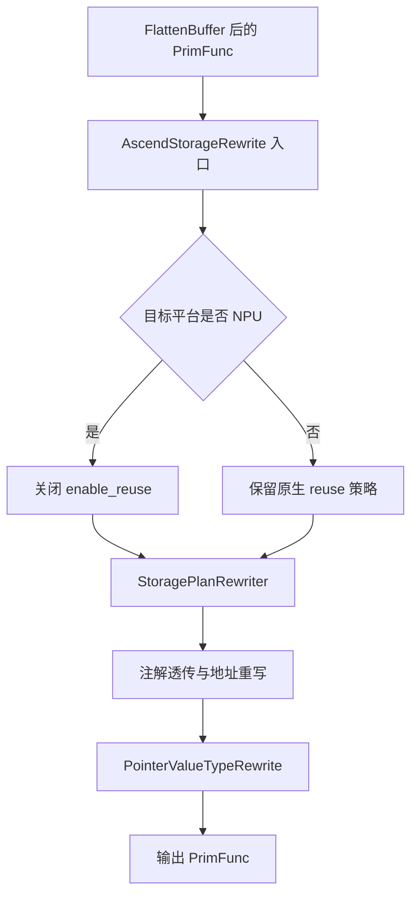

# AscendStorageRewrite Pass 设计文档

## 1. 背景与目标

* 需求来源：`AscendStorageRewrite` 并不是从零实现的新 pass，而是基于 TVM 原生 `StorageRewrite` 迁移而来。源码头部注明该实现迁移自 TVM commit `c2921fd`，本仓库中把它正式接入 TileLang 的关键变更是 commit `508db7cffd776aa20d8f9ba821cdcf8634d978db`。由于该 pass 的大部分算法逻辑已经由 TVM 提供并验证，本设计文档不详解原生实现，只简要介绍原生逻辑，并重点说明 TileLang-Ascend 的改动部分。
* 业务价值：原生 `StorageRewrite` 的目标是基于 buffer 生命周期进行 allocation 复用和地址重写，以降低中间临时存储开销。但在 Ascend 纯 vector 算子上，直接沿用原生策略会引入变量错误复用问题，进而影响后端代码生成正确性。将该 pass 收编为 TileLang 自有 pass 后，可以按平台特性关闭高风险优化、补齐注解透传，并保留后续仍然必要的类型修正能力。
* 技术目标：
  1. 以最小改动复用 TVM 原生 `StorageRewrite` 的整体框架。
  2. 在 TileLang 流水线中替换通用 `tir.transform.StorageRewrite()`，改为 `tilelang.transform.AscendStorageRewrite(is_npu=...)`。
  3. 修复未修改前纯 vector 算子上出现的变量错误复用问题。
  4. 在 NPU 平台关闭高风险 allocation reuse，同时保留仍然必要的 IR 重写职责。
  5. 保证 `tl.local_var_init` 等 Ascend 特有语义在 rewrite 后不丢失。

### 1.1 原生 Pass 逻辑简述

TVM 原生 `StorageRewrite` 的核心逻辑可以概括为三步：

1. 线性化访问序列，分析每个临时 buffer 的 live range。
2. 对生命周期不重叠的 allocation 尝试复用同一块 backing storage。
3. 在需要时执行地址重映射和指针/Buffer 类型修正。

这套逻辑在通用后端上是成立的，但其复用判定更偏向“物理空间是否兼容”，不完全考虑 Ascend 纯 vector 场景对变量语义稳定性的要求。

### 1.2 纯 Vector 算子错误复用问题分析

在未修改前，直接沿用 TVM 原生 `StorageRewrite` 的复用策略时，纯 vector 算子会出现变量错误复用问题。其核心现象不是 allocation 数量变化，而是**生命周期不重叠但 dtype 不同、语义不同的中间临时变量，被规划到同一个 backing storage 上**。

该问题在纯 vector 算子上更容易暴露，主要原因有三点：

* 临时变量密集：逐元素计算、cast、mask、归约中间值较多，容易命中 reuse。
* dtype 更混杂：`fp16 -> fp32`、`int32 -> bool/int8`、vector lane 扩缩等场景常见。
* 后续隔离较弱：纯 vector 路径不像 cube 场景那样有更强的专用内存规划来兜底。

问题的直接触发点在 `FindAlloc()` 的复用条件。[src/transform/ascend_storage_rewrite.cc](https://github.com/tile-ai/tilelang-ascend/blob/ascendc_pto/src/transform/ascend_storage_rewrite.cc#L1034) 对“大于等于目标大小”的候选 allocation，原生思路主要检查：

* attach scope 是否一致；
* storage scope 是否一致；
* `bits_offset` 是否能被当前元素位宽整除。

只有在 `reuse_require_exact_matched_dtype` 被显式开启时，才会额外要求 dtype 精确匹配。[src/transform/ascend_storage_rewrite.cc](https://github.com/tile-ai/tilelang-ascend/blob/ascendc_pto/src/transform/ascend_storage_rewrite.cc#L1081)

这在通用后端是合理的，因为它把 backing storage 视作可重解释的物理内存；但在 Ascend 纯 vector 场景下，后端更关心变量的元素类型语义、初始化语义和访问模式是否稳定。这里需要注意一个细节：`fp16 -> fp32/int32` 这类不同 dtype 的复用，并不是所有情况下都会发生，而是主要发生在“已有 allocation 的位宽容量大于等于当前申请容量”的那条复用分支中；该分支默认并不强制要求 base dtype 一致。因此，只要旧 allocation 在 bit 数上足够大，且 `bits_offset` 能被新元素位宽整除，就可能出现“前一个生命周期结束的 `fp16` 临时变量，被后一个 `fp32` 或 `int32` 临时变量复用”的情况。从容量角度看没有问题，但从语义角度看这是高风险行为。

因此，这个问题的本质不是 liveness 分析错误，而是**原生 pass 的“按物理位宽兼容即可复用”的优化假设，与 Ascend 纯 vector 路径对变量类型语义稳定性的要求发生了冲突**。

### 1.3 问题 Issue 描述与最小 IR 示例

* 缺陷标题：纯 vector 算子中不同 dtype 的临时变量被 `StorageRewrite` 错误复用。
* 触发条件：两个临时 buffer 位于同一 attach scope，live range 不重叠，storage scope 相同，且后者空间需求落入前者的复用匹配区间。
* 预期行为：不同逻辑类型的临时变量应保持独立 allocation 语义，至少不应在 Ascend vector 路径上共享同一底层存储实体。
* 实际行为：后一个变量可能直接映射到前一个变量的 backing storage。
* 结果影响：在 Ascend vector codegen 阶段，表现为变量声明语义错位、dtype 解释不一致、初始化信息丢失，最终导致编译或运行异常。

最小化伪 IR 示例：

```python
@T.prim_func
def vector_reuse_bug(A: T.Buffer((256,), "float16"),
                     B: T.Buffer((128,), "float16")):
    temp_fp16 = T.allocate([256], "float16", "local")
    for i in T.serial(0, 256):
        temp_fp16[i] = A[i] + T.float16(1)

    temp_fp32 = T.allocate([128], "float32", "local")
    for i in T.serial(0, 128):
        temp_fp32[i] = T.Cast("float32", B[i])

    for i in T.serial(0, 128):
        B[i] = T.Cast("float16", temp_fp32[i])
```

若仅从 live range 看，`temp_fp16` 在第一段循环结束后生命周期结束，`temp_fp32` 在第二段循环开始时生成，二者不重叠。并且在这个例子里：

* `temp_fp16` 的 allocation 大小是 `256 * 16 = 4096 bits`；
* `temp_fp32` 的 allocation 大小是 `128 * 32 = 4096 bits`。

因此它们在 bit 容量上正好相等，会落入 `FindAlloc()` 中“已有 allocation 大于等于当前申请容量”的复用路径。问题在于 Ascend 纯 vector 路径不只关心“内存够不够大”，还关心“这块内存是否仍然代表同一种类型语义”。

### 1.4 本仓库相对 TVM 原生 Pass 的主要修改

结合 commit `508db7cffd776aa20d8f9ba821cdcf8634d978db`，本仓库对原生 `StorageRewrite` 的修改主要集中在以下几项：

* Pass 接入方式改动：在 [tilelang/engine/phase.py](https://github.com/tile-ai/tilelang-ascend/blob/ascendc_pto/tilelang/engine/phase.py#L100) 中，用 `tilelang.transform.AscendStorageRewrite(is_npu=check_npu_availability())` 替换原来的 `tir.transform.StorageRewrite()`。
* Python/FFI 暴露改动：在 [tilelang/transform/__init__.py](https://github.com/tile-ai/tilelang-ascend/blob/ascendc_pto/tilelang/transform/__init__.py#L482) 中新增 `AscendStorageRewrite(is_npu: bool = False)`，并在 [src/transform/ascend_storage_rewrite.cc](https://github.com/tile-ai/tilelang-ascend/blob/ascendc_pto/src/transform/ascend_storage_rewrite.cc#L1960) 注册 `tl.transform.AscendStorageRewrite`。
* NPU 平台策略改动：在 [src/transform/ascend_storage_rewrite.cc](https://github.com/tile-ai/tilelang-ascend/blob/ascendc_pto/src/transform/ascend_storage_rewrite.cc#L1932) 中，NPU 目标下直接设置 `enable_reuse = false;`，关闭高风险 allocation reuse。
* 注解透传改动：在 [src/transform/ascend_storage_rewrite.cc](https://github.com/tile-ai/tilelang-ascend/blob/ascendc_pto/src/transform/ascend_storage_rewrite.cc#L1937) 读取 `tl.local_var_init`，并通过 [src/transform/ascend_storage_rewrite.cc](https://github.com/tile-ai/tilelang-ascend/blob/ascendc_pto/src/transform/ascend_storage_rewrite.cc#L664) 的 `MakeAllocateAnnotations()` 把初始化语义重新挂回新的 `Allocate`。

这些改动都不是重写原生算法，而是把原生 pass 收编到 TileLang-Ascend 的平台控制框架中。

## 2. 整体设计

`AscendStorageRewrite` 在流水线中的位置是 `FlattenBuffer` 之后、`UnrollLoop` 之前。[tilelang/engine/phase.py](https://github.com/tile-ai/tilelang-ascend/blob/ascendc_pto/tilelang/engine/phase.py#L97-L101) 它整体上仍沿用 TVM 原生 pass 的处理骨架，但在入口处增加了 Ascend 平台决策。



整体设计重点不在重新设计原生算法，而在于：

* 把原生逻辑接入 TileLang pass 体系。
* 在 NPU 平台关闭错误复用来源。
* 保留后续 Ascend 代码生成仍然需要的 rewrite 能力。

## 3. 详细设计

### 3.1 修改点设计

本章只说明相对 TVM 原生 `StorageRewrite` 的修改部分，不展开原生 pass 本身的数据结构和完整算法流程。

当前修改逻辑可以概括为三项：

1. 接入 TileLang 流水线：在 [tilelang/engine/phase.py](https://github.com/tile-ai/tilelang-ascend/blob/ascendc_pto/tilelang/engine/phase.py#L100) 中，用 `tilelang.transform.AscendStorageRewrite(is_npu=check_npu_availability())` 替换原来的 `tir.transform.StorageRewrite()`。
2. 增加 NPU 平台门控：在 [src/transform/ascend_storage_rewrite.cc](https://github.com/tile-ai/tilelang-ascend/blob/ascendc_pto/src/transform/ascend_storage_rewrite.cc#L1932) 中，NPU 目标下直接设置 `enable_reuse = false;`，关闭最容易引发纯 vector 错误复用的常规 allocation reuse。
3. 保留 Ascend 语义修正：在 rewrite 后继续透传 `tl.local_var_init` [src/transform/ascend_storage_rewrite.cc](https://github.com/tile-ai/tilelang-ascend/blob/ascendc_pto/src/transform/ascend_storage_rewrite.cc#L1937)，并保留 `PointerValueTypeRewrite()` [src/transform/ascend_storage_rewrite.cc](https://github.com/tile-ai/tilelang-ascend/blob/ascendc_pto/src/transform/ascend_storage_rewrite.cc#L1953)，保证初始化语义和向量化类型修正不丢失。

### 3.2 修改后的处理逻辑

原生 pass 的主体分析流程保持不变，这里的修改主要体现在入口策略和后处理语义上：

1. 入口阶段读取 `merge_static_smem`、目标平台和 `tl.local_var_init` 等信息。[src/transform/ascend_storage_rewrite.cc](https://github.com/tile-ai/tilelang-ascend/blob/ascendc_pto/src/transform/ascend_storage_rewrite.cc#L1906-L1938)
2. 若目标平台是 NPU，则直接关闭 `enable_reuse`，阻断常规 free-list 复用路径。[src/transform/ascend_storage_rewrite.cc](https://github.com/tile-ai/tilelang-ascend/blob/ascendc_pto/src/transform/ascend_storage_rewrite.cc#L1930-L1932)
3. 在新生成的 `Allocate` 上重新挂回 `tl.local_var_init` 注解，避免初始化语义丢失。[src/transform/ascend_storage_rewrite.cc](https://github.com/tile-ai/tilelang-ascend/blob/ascendc_pto/src/transform/ascend_storage_rewrite.cc#L664)
4. 在 storage rewrite 之后继续执行 `PointerValueTypeRewrite()`，保留 buffer/pointer 的向量化类型修正能力。[src/transform/ascend_storage_rewrite.cc](https://github.com/tile-ai/tilelang-ascend/blob/ascendc_pto/src/transform/ascend_storage_rewrite.cc#L1953)

### 3.3 NPU 平台关闭 Reuse 后的剩余职责

`is_npu=true` 时，pass 入口会把 `enable_reuse` 设为 `false`。[src/transform/ascend_storage_rewrite.cc](https://github.com/tile-ai/tilelang-ascend/blob/ascendc_pto/src/transform/ascend_storage_rewrite.cc#L1930-L1932) 这意味着它不再执行基于 free list 的常规 allocation 复用，但并不意味着整个 pass 没用了。

NPU 路径下该 pass 仍然承担以下职责：

* 保留 inplace 复用能力：`InplaceOpVerifier` 的检测发生在 `FindAlloc()` 之前，因此即使 `enable_reuse=false`，安全的 `dst[index] = f(src[index])` 模式仍然可能直接复用源变量的 `StorageEntry`。[src/transform/ascend_storage_rewrite.cc](https://github.com/tile-ai/tilelang-ascend/blob/ascendc_pto/src/transform/ascend_storage_rewrite.cc#L959-L979)
* 保留 `tl.local_var_init` 注解透传：入口读取 PrimFunc attrs，并在新生成的 `Allocate` 上重新挂回注解。[src/transform/ascend_storage_rewrite.cc](https://github.com/tile-ai/tilelang-ascend/blob/ascendc_pto/src/transform/ascend_storage_rewrite.cc#L1935-L1938)
* 保留地址与 Buffer 重写框架：`VisitBufferAccess()`、`VisitExpr_(VarNode)`、`VisitExpr_(CallNode)` 仍然统一处理 buffer remap、索引和 `tvm_access_ptr` 访问。[src/transform/ascend_storage_rewrite.cc](https://github.com/tile-ai/tilelang-ascend/blob/ascendc_pto/src/transform/ascend_storage_rewrite.cc#L457-L530)
* 保留 `PointerValueTypeRewrite`：即使关闭 allocation reuse，pass 仍会根据实际访问模式重写 buffer/pointer 的元素类型、shape 和索引形式，以适配向量化访问。[src/transform/ascend_storage_rewrite.cc](https://github.com/tile-ai/tilelang-ascend/blob/ascendc_pto/src/transform/ascend_storage_rewrite.cc#L1953)

因此，NPU 上的 `AscendStorageRewrite` 更准确的定位不是“无效 pass”，而是“关闭激进存储复用后的保守重写 pass”。它放弃的是最容易引入错误复用的优化部分，但保留了对 Ascend 后端仍然必要的几类能力：

* 安全的 inplace 复用。
* allocation 注解与地址重写。
* 向量化类型修正。

### 3.4 伪代码描述

```python
def AscendStorageRewrite(func, is_npu):
    enable_reuse = True

    if has_dynamic_shared_memory(func) or pass_ctx.merge_static_smem:
        enable_reuse = False
    if is_npu:
        enable_reuse = False

    local_var_init_map = get_attr(func, "tl.local_var_init")

    planned_body = StoragePlanRewriter.Rewrite(
        func.body,
        detect_inplace=True,
        enable_reuse=enable_reuse,
        local_var_init_map=local_var_init_map,
    )

    return PointerValueTypeRewrite(planned_body)
```

## 4. 验证章节

测试重点应围绕“修改部分是否生效”，而不是重复验证 TVM 原生算法的所有细节。

* pass 单元测试建议：
  1. 纯 vector 错误复用回归样例：构造 live range 不重叠但 dtype 不同的 vector 临时变量，验证 Ascend 路径不再发生错误复用。
  2. NPU 平台开关样例：调用 `AscendStorageRewrite(is_npu=True)`，验证 `enable_reuse` 被关闭，free-list 复用不再发生。
  3. inplace 保留样例：验证在 NPU 平台关闭 reuse 后，安全的 inplace 模式仍然可以触发。
  4. `tl.local_var_init` 透传样例：验证 allocation 被 rewrite 后注解仍存在。
  5. `PointerValueTypeRewrite` 保留样例：验证关闭 reuse 后，buffer/pointer 类型修正依然执行。

* IR 校验重点：
  1. 检查不同 dtype 的临时变量是否仍保持独立 allocation 语义。
  2. 检查新的 `Allocate.annotations` 中是否保留 `tl.local_var_init`。
  3. 检查 `PointerValueTypeRewrite` 后的 buffer dtype、shape、index 是否符合预期。
  4. 检查 NPU 路径下是否仍可能出现合法的 inplace 复用。

* 风险与后续建议：
  1. NPU 上关闭 reuse 后，内存占用可能上升，这是为正确性付出的显式代价。
    2. 当前设计下，不再建议重新打开 NPU 上的常规 allocation reuse。对于 Ascend 平台，内存规划与复用已经由 [src/transform/ascend_memory_planning.cc](https://github.com/tile-ai/tilelang-ascend/blob/ascendc_pto/src/transform/ascend_memory_planning.cc) 中的 `AscendMemoryPlanning` pass 负责，因此这里保持保守策略即可。
    3. 现阶段更清晰的职责边界是：`AscendStorageRewrite` 负责规避错误复用、保留 inplace、透传 `tl.local_var_init` 以及执行 `PointerValueTypeRewrite`；NPU 上真正的内存规划与复用由 `AscendMemoryPlanning` 统一处理。