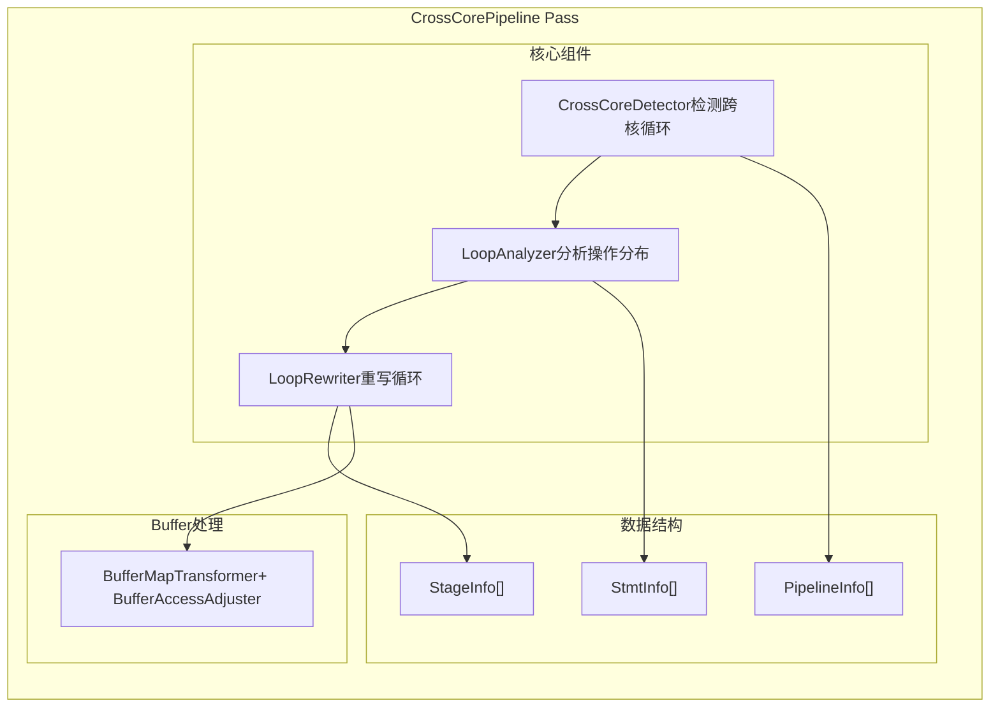
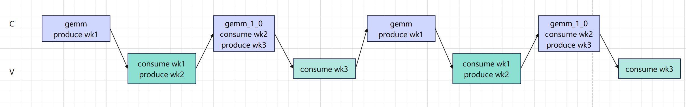
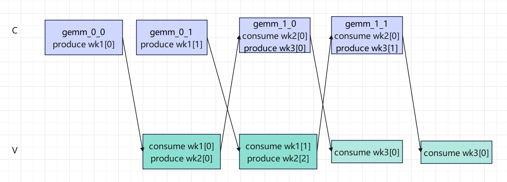
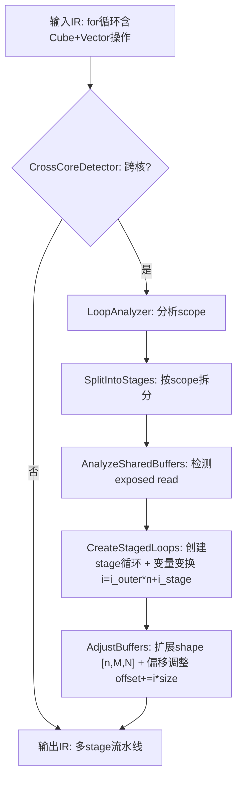

## 1. 背景与目标

* 需求来源： 昇腾 NPU 采用异构多核架构，包含 **Cube 核**（负责矩阵计算，如 GEMM）和 **Vector 核**（负责tile计算，如 Add/Mul/Exp）。用户通过 `T.Pipelined(loop_num, num_stages)` 标注循环，当同一循环内同时包含 Cube 和 Vector 操作时，需要构建跨核流水线，使双核异步并行执行，隐藏计算延迟、提升硬件利用率。
* 业务价值： 串行模式下 Cube 运行时 Vector 空闲，反之亦然，核利用率低。流水线化后，Cube 产出第 i+1 片数据的同时 Vector 消费第 i 片数据，双核 overlap 执行。适用于 GEMM + tile级操作融合的算子（如 SFA、FlashAttention）。
* 技术目标： 自动检测跨核循环 → 按 Cube/Vector scope 拆分为独立 stage → 扩展 workspace buffer 维度实现多版本 → 生成多 stage 循环结构 → 由后续 `AscendSyncInsert` pass 插入 `set_flag/wait_flag` 同步指令。

### 1.1 调用示例

```python
# 核间 pipeline 示例
for i T.Pipelined(cross_core_proc_num, num_stages=2):  # CV核间pipeline
    T.copy(Q[m_i, :], q_l1)
    T.copy(K[m_i, :], k_l1)
    T.gemm(q_l1, k_l1, acc_s_l0c)          # Cube 操作
    T.copy(acc_s_l0c, workspace_1)          # Cube → workspace

    T.copy(workspace_1, acc_s_ub_)          # workspace → Vector
    T.add(acc_s_ub, acc_s_ub, acc_s_ub_)   # Vector 操作
    ...
```

### 1.2 cross_interval 参数

`cross_interval` 为控制跨核同步频率的可选参数，默认为1，通过 `T.Pipelined` 的第三个参数传入。该参数会被 CrossCorePipeline 记录到 stage 循环注解（`tl_cross_interval`）中，由后续 `CombineCV` pass 在生成 `CrossCoreSetFlag` / `CrossCoreWaitFlag` 时实际使用。

```python
# cross_interval=1: 每次迭代同步（默认）
for k in T.Pipelined(num_iters, num_stages=2, cross_interval=1):
    # CrossCoreSetFlag 每次迭代执行
    # CrossCoreWaitFlag 每次迭代执行

# cross_interval=2: 每2次迭代同步
for k in T.Pipelined(num_iters, num_stages=4, cross_interval=2):
    # SetFlag 在 i%2==1 或末次迭代时执行
    # WaitFlag 在 i%2==0 时执行
```

| cross_interval | 同步频率 | SetFlag 时机 | WaitFlag 时机 | 适用场景 |
|----------------|----------|-------------|--------------|---------|
| 1（默认） | 每次迭代 | 每次迭代 | 每次迭代 | 默认，最高并行度 |
| N | 每 N 次迭代 | `i%N==N-1` 或末次 | `i%N==0` | 减少同步开销，多 KV cache |

**使用效果（以 cross_interval=2, num_stages=4 为例）：**

```
迭代:   i=0      i=1       i=2      i=3
Cube:   write_0  write_1   write_2  write_3
        wait_0   ---       wait_2   ---
        ---      set_1     ---      set_3+last
Vector: ---      read_0    read_1   read_2
                wait_1             wait_3
                set_0              set_2
```

- `cross_interval=1`：每次迭代都同步，最大粒度的 CV overlap，但同步指令开销最大
- `cross_interval=N`：每 N 次迭代同步一次，减少同步指令数量，适用于同一份数据被连续多次消费的场景（如多 query 共享同一 KV cache）

**注：** cross_interval 仅在核间流水线中生效，核内流水线中此参数无效，实现逻辑见 CombineCV pass 文档。

---

## 2. 整体设计

### 2.1 架构图



### 2.2 核间流水掩盖原理

适用于 C 核和 V 核间存在数据依赖且分片计算数据时。在 A2 和 A3 中 C 和 V 通过 workspace 进行数据交互，假设完整计算流程为：

C核produce wk_1 → V核consume wk_1 → V核produce wk_2 → C核consume wk_2 → C核produce wk_3 → V核consume wk_3

**串行计算流程：**


可以看到 C 核运行时，V 核空闲；V 核运行时，C 核空闲，核利用率较低。

**开启核间流水（stage=2）后：** C 和 V 上的动作一次下发 2 个，对于每个 workspace 申请两块空间用于 CV 间交互，则 2 次计算间没有数据依赖，使能后 CV 并行流水掩盖效果：


### 2.3 计算流程图



---

## 3. 详细设计

### 3.1 数据结构设计

#### 3.1.1 PipelineInfo

```cpp
struct PipelineInfo {
  const ForNode *for_node;     // 带 num_stages 注解的循环节点
  bool is_cross_core;          // 是否为跨核循环（同时含 Cube 和 Vector）
  int32_t scene;               // 当前循环的 core scope（CUBE_SCOPE / VEC_SCOPE / INVALID_SCOPE）
  std::string loop_var_name;   // 循环变量名
};
```

#### 3.1.2 StmtInfo

```cpp
struct StmtInfo {
  int idx;                      // 语句在循环中的序号
  std::string type;             // 语句类型（"Evaluate" / "For"）
  std::string buffer_name;      // 关联的 workspace buffer 名
  Stmt stmt;                    // 原始语句
  std::set<std::string> used_buffers;  // 使用的 buffer 集合
  std::vector<AccessInfo> accesses;    // buffer 访问详情（offset, extent, rw_mask）
  int32_t scope;                // 所属 core（CUBE_SCOPE / VEC_SCOPE）
};
```

#### 3.1.3 AccessInfo

```cpp
struct AccessInfo {
  std::string buffer_name;  // buffer 名称
  PrimExpr offset;          // 访问起始偏移
  PrimExpr extent;          // 访问长度
  bool is_read;             // 是否读
  bool is_write;            // 是否写
  int order;                // 访问顺序
};
```

#### 3.1.4 WorkspaceWrite

```cpp
struct WorkspaceWrite {
  int stmt_idx;             // 写操作的语句序号
  std::string buffer_name;  // workspace buffer 名
  Call call;                // 写操作的 Call 节点
};
```

#### 3.1.5 StageInfo

```cpp
struct StageInfo {
  std::vector<LoopAnalyzer::StmtInfo> statements;  // 该 stage 包含的语句
  std::set<std::string> used_buffers;              // 该 stage 使用的 buffer
};
```

#### 3.1.6 常量定义

```cpp
#define INVALID_SCOPE -1
#define CUBE_SCOPE 0
#define VEC_SCOPE 1

// buffer scope 到 core 的映射
std::unordered_map<std::string, std::string> callnodeMapPos_ = {
    {"wmma.matrix_a", "cube"},
    {"wmma.matrix_b", "cube"},
    {"wmma.accumulator", "cube"},
    {"shared.dyn", "cube"},
    {"shared", "vec"}};
```

### 3.2 核心逻辑

#### 3.2.1 整体流程伪代码

```python
输入: PrimFunc f
处理流程:
  1. 收集 buffer scope 映射 → location_map_
  2. CrossCoreDetector.DetectCrossCorePipelines()  # 检测跨核循环
     if 无跨核循环: return f
  3. BufferMapTransformer.TransformBufferMap()      # 扩展 workspace buffer 维度
  4. LoopAnalyzer.Analyze()                         # 分析语句分布和 buffer 访问
  5. LoopRewriter.Rewrite()                         # 拆分为多 stage 循环
     a. SplitIntoStages()                            # 按 scope 连续性拆分
     b. AnalyzeSharedBuffers()                       # 检测暴露读，确定共享 buffer
     c. CreateStagedLoops()                          # 为每个 stage 创建循环
  6. AdjustBuffersAndAccess()                       # 调整共享 buffer 的访问偏移
  7. ExtendAllBuffers()                             # 扩展 alloc_buffers 的 shape
输出: 变换后的 PrimFunc（含多 stage 流水线结构）
```

#### 3.2.2 CrossCoreDetector - 跨核检测

```python
输入: Stmt (IR 语句树)
处理流程:
  1. VisitStmt_(ForNode):
     - 检查是否有 num_stages 注解
     - 有 → 创建 PipelineInfo，递归访问 body
     - 无 → 直接递归访问 body

  2. VisitStmt_(EvaluateNode):
     - 提取 Call 节点中的 buffer 引用
     - 通过 location_map_ 判断 buffer 所属 core
     - 更新 current_pipeline_info_.scene
     - 若 scene 从 CUBE 变为 VEC 或反之 → is_cross_core = true

  3. 返回所有 is_cross_core=true 的 PipelineInfo
输出: vector<PipelineInfo> (跨核循环列表)
```

**IR 变换示例：**

```
# 变换前（检测到混合操作）
for i in range(N) @num_stages=2:
  call_extern("copy_l1_to_l0a", tvm_access_ptr(A, ...))  ← cube scope
  call_extern("copy_ub_to_l1", tvm_access_ptr(B, ...))   ← vec scope
  → is_cross_core = true

# 变换后（进入 LoopAnalyzer）
```

#### 3.2.3 LoopAnalyzer - 语句分析

```python
输入: ForNode (跨核循环体)
处理流程:
  1. VisitStmt_(EvaluateNode):
     - 确定当前语句的 core_scope_
     - 分配 idx_C 或 idx_V（分别计数）
     - 收集 buffer accesses（通过 tvm_access_ptr 参数）
     - 记录 workspace writes（copy_l0c_to_gm / copy_ub_to_gm）

  2. VisitStmt_(ForNode):
     - 保存当前状态，递归访问 body
     - 将子语句的 buffer access 聚合到 For 节点
     - 合并到 all_statements_C / all_statements_V / all_statements

  3. 返回:
     - all_statements_C: Cube 侧语句列表
     - all_statements_V: Vector 侧语句列表
     - all_statements_: 统一语句列表（含 scope 标记）
     - workspace_writes_C/V: 各侧的 workspace 写操作
输出: 分析结果（供 LoopRewriter 使用）
```

#### 3.2.4 LoopRewriter - 循环重写

```python
输入: LoopAnalyzer 结果 + num_stages + original_loop
处理流程:
  1. SplitIntoStages():
     - 遍历 all_statements_，按 scope 连续性分组
     - scope 变化时开启新 stage
     - 返回: vector<StageInfo>

  2. AnalyzeSharedBuffers(stages):
     - 对每个在多个 stage 中出现的 buffer:
       - 收集该 stage 中对该 buffer 的所有读操作
       - CheckExposedRead(): 检查是否存在"暴露读"
         （即读操作之前没有覆盖该范围的写操作）
       - 有暴露读 → 标记为 shared_buffer

  3. CreateStagedLoops(stages):
     - 对每个 stage:
       - 创建 stage_loop: for i_stage in range(num_stages)
       - 添加 LetStmt 绑定: i_transformed = i_outer * num_stages + i_stage
       - 注解: stage_loop=true, tl_cross_interval, tl_original_loop_var
     - 返回: SeqStmt(stage_loops) 或单个 loop

  4. ModifyOuterLoop():
     - 创建外层循环: for i_outer in range(N / num_stages)
     - 注解: tl_original_extent
     - body = staged_loops

  5. AdjustBuffersAndAccess():
     - 对 shared_buffer 和 workspace_buffer:
       - 扩展 shape: 插入 num_stages 作为第一维
       - 调整 tvm_access_ptr offset: original + i_stage * total_size

  6. ExtendAllBuffers():
     - 扩展 Block 的 alloc_buffers shape
     - 记录 buffer_versions（供后续 pass 使用）
输出: 重写后的 Stmt（多 stage 流水线结构）
```

#### 3.2.5 CheckExposedRead - 暴露读分析

```python
输入: Stmt (子树), target_buf, target_offset, target_extent, covered
处理流程:
  1. EvaluateNode (叶子节点):
     - 检查是否读 target_buf 的 target 范围 → reads = true
     - 检查是否写覆盖 target 范围 → kills = true
     - 返回: {reads && !covered, kills}

  2. SeqStmtNode (顺序语句):
     - 依次递归，传递 covered || any_kills
     - exposed = A.exposed || (!A.kill && B.exposed)
     - kill = A.kill || B.kill

  3. ForNode (循环):
     - 只检查 body（假设第一次迭代无前序 kill）
     - 返回: CheckExposedRead(body, ..., covered)

  4. IfThenElseNode (条件):
     - exposed = then.exposed || else.exposed
     - kill = then.kill && else.kill
输出: pair<bool, bool> (has_exposed_read, must_kill)
```

**保守策略：**

- `RangeContains`: 仅当所有值为常量时才能证明包含关系
- `RangeOverlaps`: 非常量时保守返回 `true`（假设重叠）

### 3.3 关键算法

#### 3.3.1 Stage 拆分规则

```
输入语句序列: [S0(C), S1(V), S2(V), S3(C), S4(V)]

拆分结果:
  Stage 0 (CUBE): [S0]
  Stage 1 (VEC):  [S1, S2]
  Stage 2 (CUBE): [S3]
  Stage 3 (VEC):  [S4]

规则: scope 连续时合并，scope 变化时切分
```

#### 3.3.2 Buffer 版本管理

```
原始 buffer: workspace_0 shape=[M, N]

扩展后: workspace_0 shape=[num_stages, M, N]

访问调整:
  stage 0 访问: offset + 0 * (M*N)
  stage 1 访问: offset + 1 * (M*N)
  stage i 访问: offset + i * (M*N)

目的: 每个 stage 使用独立的 buffer 版本，避免数据竞争
```

#### 3.3.3 循环变量变换

```
原始循环: for i in range(N)

变换后:
  for i_outer in range(N / num_stages):
    for i_stage in range(num_stages):
      i_transformed = i_outer * num_stages + i_stage
      # 原 body 中所有 i 的引用替换为 i_transformed

效果: 将原循环展开为 num_stages 级流水线
```

---

## 4. 验证章节

### 4.1 测试例设计

#### 4.1.1 测试场景

| 测试编号 | 测试场景 | 输入 IR 特征 | 预期输出 |
|---------|---------|-------------|---------|
| UT-01 | 跨核循环（Cube+Vector） | for 循环内混合 Cube 和 Vector | 拆分为 2 个 stage |
| UT-02 | 跨核循环（多次切换） | C→V→C→V 交替 | 拆分为 4 个 stage |
| UT-03 | 带嵌套 For 的跨核循环 | 循环体内含子循环 | 子循环正确聚合到父节点 |
| UT-04 | 共享 buffer 检测 | 多个 stage 读写同一 buffer | buffer shape 扩展为 [num_stages, ...] |
| UT-05 | 无共享 buffer | 各 stage 使用独立 buffer | 不扩展 buffer shape |
| UT-06 | workspace buffer 写操作 | 含 copy_l0c_to_gm | 正确记录 workspace_writes |
| UT-07 | num_stages=1 | 单 stage 流水线 | 不触发跨核变换 |

#### 4.1.2 算子样例

| 测试编号 | 算子场景 |
|---------|---------|
| OP-01 | FlashAttention |
| OP-02 | Sparse FlashAttention |
| OP-03 | Sparse FlashAttention GQA |

#### 4.1.3 边界测试

| 测试场景 | 输入 | 结果 |
|---------|------|---------|
| 空循环体 | for i in range(N): pass | 不崩溃，原样返回 |
| 单条语句 | for i in range(N): gemm(...) | 不触发跨核变换 |
| buffer 未找到 scope | buffer 不在 location_map_ 中 | 跳过，不标记为跨核 |

### 4.2 验证方法

#### 4.2.1 IR 校验

- stage划分正确
- 循环变量改写正确
- workspace，以及L1/UB上的buffer扩展正确
- 扩展后buffer偏移正确

#### 4.2.2 正确性校验

- 翻译出的后端源码符合预期
- 精度正确

#### 4.2.3 性能校验

开启核间pipeline后性能有提升。

### 4.3 配置项

```python
# 启用 CrossCorePipeline Pass
pass_configs = {
    "tl.ascend_auto_cv_combine": True,
    "tl.ascend_auto_cross_core_sync": True,
}

# 在 jit 中使用
@tl.jit(pass_configs=pass_configs)
def kernel(...):
    ...
```

---

## 5. 附录

### 代码位置

| 组件 | 路径 | 核心元素 |
|------|------|---------|
| C++ 实现 | `src/transform/cross_core_pipeline.cc` | `CrossCorePipeline::Substitute()` |
| 检测器 | `src/transform/cross_core_pipeline.cc` | `CrossCoreDetector::DetectCrossCorePipelines()` |
| 分析器 | `src/transform/cross_core_pipeline.cc` | `LoopAnalyzer::Analyze()` |
| 重写器 | `src/transform/cross_core_pipeline.cc` | `LoopRewriter::Rewrite()` |
| 暴露读分析 | `src/transform/cross_core_pipeline.cc` | `CheckExposedRead()` |
| Buffer 变换 | `src/transform/cross_core_pipeline.cc` | `BufferMapTransformer::TransformBufferMap()` |
| Pass 注册 | `src/transform/cross_core_pipeline.cc` | `TVM_REGISTER_GLOBAL("tl.transform.CrossCorePipeline")` |
| 配置键 | - | `tl.ascend_auto_cross_core_sync` |

---

### 与其他 Pass 的协作

**整体 Pass 执行顺序见：** [T.Pipelined.md](../../T.pipelined.md)

CrossCorePipeline 输出信息及下游消费关系：

| 输出 | 传递给 | 用途 |
|------|-------|------|
| stage loop 注解（`stage_loop`, `tl_cross_interval`, `tl_original_loop_var`） | `CombineCV`, `AscendSyncInsert` | CV 代码划分、同步指令插入 |
| `buffer_versions` 属性 | `AscendMemoryPlanning` | workspace buffer 内存规划 |
| 多 stage 循环结构 | `AscendSyncInsert` | 插入 `set_flag/wait_flag` |

**互斥约束：** 核内 pipeline（PipelinePlanning + InjectSoftwarePipeline）与核间 pipeline 互斥，不会同时执行。