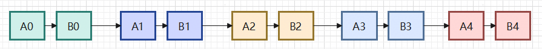
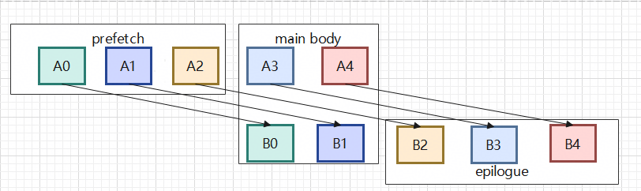

## 1. 背景与目标

* 需求来源： 在NPU的Cube核或Vector核内部，存在数据搬运（CopyIn/CopyOut）和计算（GEMM/ElementWise）两种操作。用户通过 `T.Pipelined(loop_num, num_stages)` 标注循环，编译器需自动将搬运和计算排成软件流水线，使同一核内的搬运和计算能够 overlap 执行，隐藏访存延迟。
* 业务价值： 核内串行执行时，搬运和计算无法重叠，核利用率低。流水线化后，上一片数据的计算与下一片数据的搬运并行执行，显著提升算子吞吐率。适用于所有存在"搬运→计算→搬运→计算"重复模式的算子（如分片GEMM、FlashAttention的KV循环等）。
* 技术目标： 自动分析循环体内各操作的读写依赖，规划 pipeline stage 和 order，生成 prologue / body / epilogue 三段式流水线结构，并正确管理 buffer 多版本。

### 1.1 调用示例

```python
# 核内 pipeline 示例
for k_i in T.Pipelined(initra_core_proc_num, num_stages=3):
    T.copy(Q[m_i, :], q_l1[k_i * LEN:(k_i+1)*LEN])   # Stage 0: CopyIn
    T.copy(K[k_i * LEN:(k_i+1)*LEN, :], k_l1)         # Stage 0: CopyIn
    T.gemm(q_l1, k_l1, l0c)                            # Stage 1: Compute
T.copy(l0c, C)                                          # Stage 2: CopyOut
```

---

## 2. 整体设计

### 2.1 整体 Pass 流程

核内流水线由两个 Pass 协作完成：

1. **PipelinePlanning**（规划）：分析循环体内的操作依赖，为每个操作分配 `stage`（流水阶段偏移）和 `order`（执行顺序），生成注解挂载到循环上。
2. **InjectSoftwarePipeline**（注入）：读取注解，将单循环拆分为 prologue / body / epilogue 三段式流水线，处理 buffer 多版本管理。

```python
def OptimizeForTarget(mod: IRModule, target: Target) -> IRModule:
    mod = tilelang.transform.PipelinePlanning()(mod)            # 核内pipeline规划
    mod = tilelang.transform.InjectSoftwarePipeline()(mod)      # 核内流水排布注入
```

### 2.2 流水掩盖原理

假设核内切片5份，存在两步操作：CopyIn(A) → Compute(B)

**串行执行：**



5份数据之间没有数据依赖，但操作完全串行。

**流水排布（num_stages=3, prefetch模式）：**


- **prefetch 阶段**：包括 num_stages-1 个 CopyIn 动作（A0 A1 A2），驱动流水线
- **main body 阶段**：Compute 和 CopyIn 交替执行（B0 A3, B1 A4, ...），实现 overlap
- **epilogue 阶段**：仅执行剩余 Compute 动作（B2 B3 B4）

### 2.3 架构图


---

## 3. 详细设计

### 3.1 数据结构设计

#### 3.1.1 PipelineAnnotation

```cpp
struct PipelineAnnotation {
  int stage;   // 流水阶段偏移（0 = 第一个stage，与prologue/epilogue计算相关）
  int order;   // 执行顺序（在流水线中的实际排列位置）
  bool async;  // 是否为异步操作（CopyIn到shared buffer标记为async）
};
```

#### 3.1.2 PipelineStageInfo（PipelinePlanning 内部）

```cpp
struct PipelineStageInfo {
  Array<BufferRegion> reads, writes;    // 该操作的读写buffer区域
  int original_order;                   // 原始位置
  int order = -1, stage = -1;           // 分配后的顺序和阶段（-1表示未分配）
  bool copy_stage = false;              // 是否为GM→L1/UB的搬运操作
  bool prepare_for_condition = false;   // 是否为条件表达式的准备操作
  int last_use_stage = -1;              // 该操作产出的最后消费位置
  PrimExpr conditonal_expr;             // 关联的条件表达式
};
```

#### 3.1.3 BufferAccessInfo

```cpp
struct BufferAccessInfo {
  int def = -1;  // 该buffer被定义（写入）的最早stage
  int use = -1;  // 该buffer被使用的最晚stage
};
```

#### 3.1.4 RewrittenBlockInfo（InjectSoftwarePipeline 内部）

```cpp
struct RewrittenBlockInfo {
  int stage;              // 流水阶段
  int order;              // 执行顺序
  PrimExpr predicate;     // 循环边界谓词
  Block block;            // 重写后的block
  PrimExpr access_index;  // 访问索引（用于async wait计算）
  bool is_async;          // 是否为异步操作
};
```

### 3.2 核心逻辑

#### 3.2.1 PipelinePlanning - 规划流程伪代码

```python
输入: PrimFunc f
处理流程:
  1. 遍历 PrimFunc body，寻找带 num_stages 注解的 for 循环
  2. 对每个 pipeline 循环:
     a. 收集循环体内的 SeqStmt 子语句
     b. MakePipelineStageInfo(): 分析每个操作的 reads/writes/copy_stage
        - BufferRegionCollector: 通过 VisitStmt/VisitExpr 收集 buffer 读写信息
        - 检测 GM→shared 的搬运模式 (is_global_copy_pattern)
     c. 分析条件表达式准备操作 (prepare_for_condition)
        - 若某操作的 write buffer 被条件表达式中的 BufferLoad 引用
        - 标记该操作为条件准备操作
     d. Use-Def 分析 (计算 last_use_stage):
        - 对每个 copy_stage，遍历后续操作的 reads
        - 若 read buffer 与 write buffer 有重叠 → 更新 last_use_stage
        - 检测多写冲突 → 报错
     e. 分配 stage 和 order:
        - 跳过 copy_stage(有活跃last_use) 和 prepare_for_condition 操作
        - 主逻辑操作: stage = num_stages, order = order_idx++
        - copy_stage(消费位置匹配): stage = 0, order = order_idx++
        - 处理尾部未分配 copy_stage
     f. 优化: 若所有 copy 操作在末尾 → 循环移到开头，stage 减1
     g. 将 stage/order 转为标准注解:
        - software_pipeline_stage → stages[]
        - software_pipeline_order → orders[]
        - software_pipeline_async_stages → {0}（若支持异步拷贝）
  3. 返回带注解的 IR
输出: 带 pipeline 注解的 PrimFunc
```

#### 3.2.2 BufferRegionCollector - 读写收集

```python
输入: Stmt (单个操作)
处理流程:
  1. VisitStmt_(BufferStoreNode):
     - 记录 store region → writes
     - 检测 GM→shared 模式

  2. VisitExpr_(BufferLoadNode):
     - 记录 load region → reads
     - 检测 global scope 读取

  3. VisitExpr_(CallNode):
     - address_of → 记录全量读取
     - tvm_access_ptr → 通过 buffer_data_to_buffer_ 查找 buffer
     - call_extern → 通过 OperationConfig 查询参数的 read/write 类型
     - 其他已知 Op → 同样通过 OperationConfig 处理
     - if_then_else → 合并条件，访问 then/else

  4. VisitStmt_(IfThenElseNode):
     - 记录 condition → conditonal_expr
     - 访问 then_case 和 else_case
输出: reads[], writes[], is_global_copy_pattern, conditonal_expr
```

#### 3.2.3 InjectSoftwarePipeline - 注入流程伪代码

```python
输入: 带 pipeline 注解的 PrimFunc f
处理流程:
  1. PipelineInjector.Inject(f):
     a. 收集 buffer_data_to_buffer_ 映射
     b. 递归访问 for 循环
     c. 对带 pipeline 注解的循环:
        - 提取 pipeline_body, predicate_condition, pipeline_allocs
        - 提取 software_pipeline_stage / software_pipeline_order 注解
        - Blockize: 将子语句转为独立 Block
        - ValidatePipelineBody(): 校验依赖关系
        - 调用 PipelineRewriter.BuildPipeline()

  2. PipelineRewriter.BuildPipeline():
     a. GetBufferAccessInfo(): 分析每个buffer的 def/use stage
     b. ComputeBufferVersions(): 计算buffer需要的版本数
        - 版本数上界 = use - def + 1
        - 优化: 版本数=2时，检查是否真正需要多版本
          (需要写block在顺序上先于读block，且stage不同，且区域重叠)
        - num_versions > 1 → RewriteAllocBuffer(): 扩展第一维
     c. 分析 async commit groups
     d. EmitImpl() 生成三段:
        - prologue: [min, min + max_stage)  unroll=true
        - body:     [min + max_stage, min + extent)  unroll=false
        - epilogue: [min + extent, min + extent + max_stage)  unroll=true
     e. 为每个阶段内的 block:
        - 计算 skewed_loop_var = new_loop_var - stage
        - 边界检查 predicate (若 need_bound_check)
        - PipelineBodyRewriter 重写 buffer 访问:
          - BufferStore/Load: 插入 version 维度 = floormod(...)
          - tvm_access_ptr: index = old_index + floormod(...) * offset
        - 若 predicate_condition: 添加 IfThenElse 保护
        - 若 async: 添加 async_scope AttrStmt
     f. PopulateWaitCounts(): 计算 async wait count
     g. CompletePipelineLoopStatements(): 插入 async_wait / async_commit

  3. 生成新 Block 包含扩展后的 alloc_buffers
  4. 收集 buffer_versions 传递给后续 pass
输出: 三段式流水线 IR
```

#### 3.2.4 ValidatePipelineBody - 依赖校验

```python
输入: pipeline_info (stage/order映射), original_order (原始语句顺序)
校验规则:
  1. order 唯一性: 每个语句的 order 必须唯一
  2. 依赖关系校验:
     - BuildDependencyGraph(): 基于 read-after-write 构建依赖边
     - 对每条依赖边 src → dst:
       - 必须 stage(src) <= stage(dst)  (否则报错)
       - 若 stage(src) == stage(dst): 必须 order(src) < order(dst)
```

### 3.3 关键算法

#### 3.3.1 Stage/Order 分配算法

```
输入: pipeline_stage_infos = [
  {idx:0, copy:true,  last_use:2, reads:[GM], writes:[L1_A]},  // CopyIn A
  {idx:1, copy:true,  last_use:3, reads:[GM], writes:[L1_B]},  // CopyIn B
  {idx:2, copy:false, reads:[L1_A,L1_B], writes:[L0C]},        // GEMM
  {idx:3, copy:false, reads:[L0C], writes:[UB]},               // CopyOut
  {idx:4, copy:false, reads:[UB], writes:[GM]},                // WriteBack
]
num_stages = 2

分配过程:
  跳过 copy_stage with last_use != -1 (idx:0,1) 和 prepare_for_condition
  主逻辑:
    idx:2 → stage=2, order=0
    copy whose last_use==2 (idx:0) → stage=0, order=1
    idx:3 → stage=2, order=2
    copy whose last_use==3 (idx:1) → stage=0, order=3
    idx:4 → stage=2, order=4

  尾部未分配: 无

结果:
  stages = [0, 0, 2, 0, 2]    # 实际偏移后会调整
  orders = [1, 3, 0, 2, 4]
```

#### 3.3.2 Buffer 多版本管理

```
分析 buffer "L1_A":
  def_stage = 0 (stage 0 写入)
  use_stage = 2 (stage 2 读取 GEMM)

  num_versions 上界 = 2 - 0 + 1 = 3

  优化检查:
    写block(stage=0)的 order < 读block(stage=2)的 order → Y
    stage(0) < stage(2) → Y
    区域重叠 → Y
    → need_multi_version = true, num_versions = 3

  扩展: L1_A[M,N] → L1_A[3,M,N]
  访问重写: 
    Store: indices.insert(0, floormod(loop_var - min, 3))
    Load:  indices.insert(0, floormod(loop_var - min, 3))
```

#### 3.3.3 三段式循环生成

```
原始循环: for i in range(N) @stages=[0,1] @orders=[0,1]
  block_A (stage=0): CopyIn
  block_B (stage=1): Compute

max_stage = 1

prologue (unroll): for i in [0, 1)
  block_A: loop_var=0, predicate=(0 >= 0 && 0 < N) → true
           skewed = 0 - 0 = 0
           buffer_A version = floormod(0-0, 2) = 0

body (normal): for i in [1, N)
  block_A: skewed = i-0 = i, version = floormod(i, 2)
  block_B: skewed = i-1, version = floormod(i-1, 2)
           → 两者在不同版本上操作，无数据冲突

epilogue (unroll): for i in [N, N+1)
  block_B: skewed = i-1 = N-1, version = floormod(N-1, 2)
```

### 3.4 Async Commit Group 管理

```python
# async commit group 将相关的异步操作分组
# 一个 commit group 内的最后一个操作会被标记为 commit

async_states: {
  stage_0: {
    commit_groups: [[order_0], [order_2]],   # 两组独立的async操作
    dst_buffers: {L1_A, L1_B},
    producer_head: symbolic_index
  }
}

# async wait: 在消费者之前插入
# wait_count = producer_head - consumer_head
# 按commit group粒度计算，独立group可放松约束
```

---

## 4. 验证章节

### 4.1 测试例设计

#### 4.1.1 测试场景

| 测试编号 | 测试场景 | 输入特征 | 预期输出 |
|---------|---------|---------|---------|
| UT-01 | 搬运+计算流水线 | for 内 copy + compute 混合 | 正确分配 stage/order，三段式结构 |
| UT-02 | 多级流水 num_stages=3 | 3 级软件流水线 | max_stage=2，prologue/body/epilogue 正确 |
| UT-03 | Buffer 多版本计算 | def/use 跨多个 stage | buffer shape 扩展为 [num_versions, ...] |
| UT-04 | 依赖校验失败 | order 冲突 / stage 依赖反向 | 报错提示 |
| UT-05 | Vector 非原地操作流水线 | `T.tile.add(c, a, b)` 输入输出不同 buffer | 多 buffer 依赖分析正确，各 buffer 版本独立 |

#### 4.1.2 算子样例

| 测试编号 | 算子场景 | 测试文件 |
|---------|---------|---------|
| OP-01 | 分片 GEMM 核内流水 (num_stages=3) | `examples/pipeline/gemm_v0_pipeline.py` |
| OP-02 | Matmul+Add 两段核内流水 (Cube流水 + Vector流水) | `examples/pipeline/matmul_add_pipeline.py` |

**OP-01 核内流水场景说明** (`gemm_v0_pipeline.py`):

```python
with T.Scope("C"):
    loop_k = T.ceildiv(K, block_K)
    for k in T.Pipelined(loop_k, num_stages=3):
        T.barrier_all()
        T.copy(A[bx * block_M, k * block_K], A_L1)   # CopyIn
        T.copy(B[k * block_K, by * block_N], B_L1)   # CopyIn
        if k == 0:
            T.gemm_v0(A_L1, B_L1, C_L0, init=True)  # Compute
        else:
            T.gemm_v0(A_L1, B_L1, C_L0)              # Compute
        T.barrier_all()
    T.copy(C_L0, C[bx * block_M, by * block_N])       # CopyOut
```

PipelinePlanning 为 copy 分配 stage=0，为 gemm 分配 stage=num_stages。InjectSoftwarePipeline 生成 prologue/body/epilogue，其中 body 阶段 copy 和 gemm 在不同 buffer 版本上并行。

**OP-02 双段核内流水场景说明** (`matmul_add_pipeline.py`):

一个 kernel 内有两个独立的核内流水线循环：

```python
# 第一个循环: Cube 核内流水 (copy + gemm)
for k in T.Pipelined(loop_k, num_stages=3):
    T.copy(A[...], A_L1)
    T.copy(B[...], B_L1)
    T.gemm_v0(A_L1, B_L1, C_L0, ...)

# 第二个循环: Vector 核内流水 (copy + add + copy)
for i in T.Pipelined(vec_proc, num_stages=2):
    T.copy(workspace_1[...], c_ub)
    T.copy(D[...], d_ub)
    for j, k in T.Parallel(...):
        e_ub[j, k] = c_ub[j, k] + d_ub[j, k]
    T.copy(e_ub, C[...])
```

两个循环分别被 PipelinePlanning 规划、InjectSoftwarePipeline 注入，互不干扰。

#### 4.1.3 边界测试

| 测试场景 | 输入 | 预期行为 |
|---------|------|---------|
| 纯计算无搬运 | for 内无 copy 操作 | stage 分配均匀，无额外 stage 0 插入 |
| 已有注解的循环 | tl_pipeline_order/stage 已存在 | 跳过，不重新规划 |
| GM→shared 搬运检测 | call_extern copy 函数 | is_global_copy_pattern = true |

### 4.2 验证方法

#### 4.2.1 IR 校验

- software_pipeline_stage/order 注解正确生成
- stage 值 ≥ 0，order 唯一无冲突
- InjectSoftwarePipeline 生成三段式结构（prologue unrolled / body serial / epilogue unrolled）
- buffer 版本数正确（shape 第一维 = num_versions）

#### 4.2.2 正确性校验

- 运行 `examples/pipeline/gemm_v0_pipeline.py` 结果与参考一致
- 运行 `examples/pipeline/matmul_add_pipeline.py` 结果与参考一致
- 生成的后端 Ascend C 代码结构符合预期

#### 4.2.3 性能校验

开启核内流水线后性能有提升。

---

## 5. 附录

### 代码位置

| 组件 | 路径 | 核心元素 |
|------|------|---------|
| PipelinePlanning | `src/transform/pipeline_planning.cc` | `PipelinePlanner::Substitute()` |
| InjectSoftwarePipeline | `src/transform/inject_pipeline.cc` | `PipelineInjector::Inject()` |
| PipelineRewriter | `src/transform/inject_pipeline.cc` | `PipelineRewriter::BuildPipeline()` |
| OperationConfig | `src/transform/common/operation_config.*` | 外部函数的 read/write 参数配置 |
| PipelinePlanning注册 | `src/transform/pipeline_planning.cc:594` | `TVM_REGISTER_GLOBAL("tl.transform.PipelinePlanning")` |
| InjectSoftwarePipeline注册 | `src/transform/inject_pipeline.cc:1077` | `TVM_REGISTER_GLOBAL("tl.transform.InjectSoftwarePipeline")` |

---

### 与其他 Pass 的协作

**整体 Pass 执行顺序见：** [T.pipelined.md](../../T.pipelined.md)

PipelinePlanning + InjectSoftwarePipeline 输出信息及下游消费关系：

| 输出 | 传递给 | 用途 |
|------|-------|------|
| software_pipeline_stage/order 注解 | `InjectSoftwarePipeline` | 三段式循环生成依据 |
| `buffer_versions` 属性 | `AscendMemoryPlanning` | buffer 内存规划 |
| 三段式循环 + async 结构 | `AscendSyncInsert` | 插入同步指令 |
| 条件谓词 (predicate) | `AscendSyncInsert` | 条件同步 |