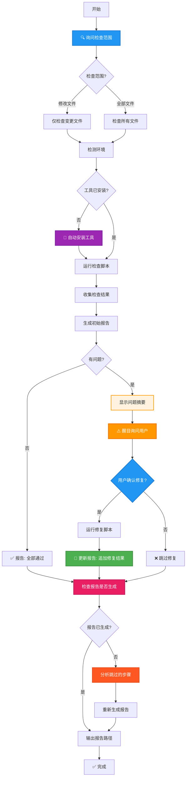

# 代码格式检查

检查代码格式并生成详细报告，与 CI 规则保持一致。

## ⚠️ 核心原则

**询问范围 + 自动安装 + 检查和修复分离**：
0. **询问范围**: 首先询问用户检查范围（修改文件 / 全部文件）
1. **自动安装**: 检测缺失工具并自动安装（ruff、clang-format）
2. **检查阶段**: 只运行检查脚本，生成报告，**不修改任何文件**
3. **询问阶段**: 使用醒目的方式询问用户是否修复
4. **修复阶段**: 只有用户明确同意后才运行修复脚本

```text
╔═══════════════════════════════════════════════════════════════╗
║  🚫 检查时严禁自动修复！必须等待用户确认！                   ║
╚═══════════════════════════════════════════════════════════════╝
```

## 工作流程



## 步骤 0: 询问检查范围 ⭐ **重要：第一步必须询问**

**在开始任何检查之前，必须先询问用户检查范围！**

使用 `AskUserQuestion` 工具询问：

```
问题: 请选择代码格式检查的范围？
选项:
  - 仅修改文件 (Recommended) - 只检查 git status 中的变更文件（修改、新增、未跟踪）
  - 全部文件 - 检查项目中的所有 Python/C++ 文件
```

**检查范围说明**:

| 范围 | 说明 | 适用场景 |
|------|------|----------|
| 仅修改文件 | 通过 `git status --porcelain` 获取变更文件 | 提交 PR 前验证、日常开发 |
| 全部文件 | 检查项目中所有匹配的文件 | CI 全量检查、代码规范初始化 |

**根据用户选择执行后续步骤**:
- 选择"仅修改文件": 调用脚本时不带 `--all` 参数
- 选择"全部文件": 调用脚本时带 `--all` 参数

## 步骤 1: 环境检测

检测必需工具是否已安装：

```bash
# 检测 ruff
ruff --version

# 检测 clang-format
clang-format --version
```

如未安装，**自动安装**：

```bash
# 检测并安装 ruff（使用独立二进制安装，安装到系统路径）
if ! command -v ruff &>/dev/null; then
    curl -LsSf https://astral.sh/ruff/install.sh | sh
fi

# 检测并安装 clang-format
if ! command -v clang-format &>/dev/null; then
    # 通过系统包管理器安装
    (sudo apt-get install clang-format-18 2>/dev/null || \
     brew install clang-format@18 2>/dev/null)
fi
```

**自动安装命令**:

| 工具 | 自动安装命令 | 说明 |
|------|-------------|------|
| ruff | `curl -LsSf https://astral.sh/ruff/install.sh \| sh` | 下载独立二进制文件，安装到 `~/.local/bin` |
| clang-format | `sudo apt-get install clang-format-18` | 系统包管理器安装 |

## 步骤 2: 运行检查脚本

从 skill 的 `scripts/` 目录调用检查脚本，**根据步骤 0 的选择传递参数**：

### 检查范围参数

| 参数 | 说明 |
|------|------|
| 无参数 | 仅检查变更文件（默认） |
| `--all` | 检查所有文件 |

### Python 检查
```bash
# 仅修改文件
bash ./scritps/check-python.sh

# 全部文件
bash ./scritps/check-python.sh --all
```

**输出**: JSON 格式
```json
{
  "issues": [...],           // ruff 检查问题
  "format_issues": [...],    // 需要格式化的文件
  "files_checked": N
}
```

### C++ 检查
```bash
# 仅修改文件
bash ./scritps/check-cpp.sh

# 全部文件
bash ./scritps/check-cpp.sh --all
```

**输出**: JSON 格式
```json
{
  "issues": [...],           // 需要格式化的文件
  "files_checked": N
}
```

### 文件获取方式

| 检查范围 | 获取方式 |
|----------|----------|
| 仅修改文件 | `git status --porcelain` 获取变更文件（修改、新增、未跟踪） |
| 全部文件 | `find` 或 `git ls-files` 获取所有匹配的文件 |

## 步骤 3: 生成报告

解析 JSON 输出，使用 `templates/report.md` 模板生成 Markdown 报告。

**报告路径**: `.agents/reports/format-report-{timestamp}.md`

**⚠️ 重要：报告文件命名规则**
- 使用时间戳格式：`format-report-YYYYMMDD_HHMMSS.md`（如 `format-report-20260316_190133.md`）
- 每次检查生成新的报告文件，**不会覆盖现有报告**
- 保留历史报告便于对比和追溯

**报告内容要求**:

### 1. 检查摘要表格
必须包含：语言、文件数、Lint 问题数、格式问题数

### 2. Python 文件问题详情（每个文件单独一个章节）
对于每个有问题的 Python 文件，必须包含：

#### Lint 问题表格
| 行号 | 代码 | 描述 | 修复建议 |
|------|------|------|----------|
| N | CODE | 详细问题描述 | 如果 ruff 提供了自动修复建议，列出 |

#### 格式问题详情
- 如果文件需要格式化，使用 `ruff format --diff <file>` 获取格式差异
- 在报告中展示格式差异的 diff 输出
- 说明具体的格式问题（如：行宽超限、缩进错误、空行不规范等）

### 3. C++ 文件问题详情（每个文件单独一个章节）
对于每个有问题的 C++ 文件，必须包含：

#### 格式问题详情
- 使用 `clang-format --dry-run --Werror <file>` 检查
- 使用 `clang-format --style=file <file> | diff -u <file> -` 获取格式差异
- 在报告中展示格式差异的 diff 输出
- 说明具体的格式问题

### 4. 问题统计摘要
按问题类型分类统计：
- Lint 问题按错误代码分类（如 UP035、F401 等）
- 格式问题按文件数统计

### 5. 下一步操作提示
提供查看问题和手动修复的命令示例

## 步骤 4: 询问修复 ⚠️ **重要：必须等待用户确认**

**⛔ 检查阶段不进行任何修复！**

完成检查后，生成报告并使用醒目的方式询问用户：

```text
╔═══════════════════════════════════════════════════════════════╗
║  📋 代码格式检查完成                                          ║
╠═══════════════════════════════════════════════════════════════╣
║  发现问题数: X                                                ║
║  - Python: N 个文件有问题                                     ║
║  - C++: N 个文件需要格式化                                    ║
║                                                               ║
║  📄 报告已保存到:                                             ║
║  .agents/reports/format-report-xxx.md                      ║
║                                                               ║
║  🔧 是否进行自动修复？（可在最后一项选择性填写单独对 C++ 或者 Python 进行修复）║
║     [ 是 / Y ] - 执行修复                                     ║
║     [ 否 / N ] - 跳过修复                                     ║
╚═══════════════════════════════════════════════════════════════╝
```

**关键规则**:
- ❌ **不要**在检查阶段自动运行修复脚本
- ✅ **必须**使用 `AskUserQuestion` 工具等待用户确认
- ✅ **只有**用户明确同意后才执行步骤 5

**⚠️ 严格遵守 AskUserQuestion 格式 ⚠️**

使用 `AskUserQuestion` 工具时，**必须严格按照以下格式**：

```
问题: 是否进行代码格式修复？
选项:
  - 是 / 同意 / Y - 执行自动修复
  - 否 / 拒绝 / N - 跳过修复（可在最后一项选择性填写单独对 C++ 或者 Python 进行修复）
```

**⛔ 禁止私自修改 AskUserQuestion 的内容和选项：**

| 禁止行为 | 说明 |
|---------|------|
| ❌ 添加额外选项 | 不要添加"仅修复 Python"、"仅修复 C++"等选项 |
| ❌ 修改问题内容 | 不要在问题中添加详细的问题说明文字 |
| ❌ 修改选项描述 | 不要修改选项的 label 或 description |
| ❌ 添加自定义选项 | 不要使用 "Type your own answer" 提供额外选项 |

**正确示例 vs 错误示例：**

❌ **错误做法**（私自添加选项和详细说明）：
```
问题: 发现 3426 个 Python lint 问题（主要是 tabs 缩进）和 20 个 C++ 格式问题。是否进行自动修复？
选项:
  - 是 / 同意 / Y (Recommended) - 自动修复所有 Python 和 C++ 格式问题
  - 仅修复 Python - 仅修复 Python 文件（lint + format）
  - 仅修复 C++ - 仅修复 C++ 文件（format）
  - 否 / 拒绝 / N - 不进行任何修复，仅查看报告
```
↑ **这是错误的！私自添加了"仅修复 Python"、"仅修复 C++"选项，并在问题中添加了详细说明**

✅ **正确做法**（严格按照模板）：
```
问题: 是否进行代码格式修复？
选项:
  - 是 / 同意 / Y - 执行自动修复
  - 否 / 拒绝 / N - 跳过修复（可在最后一项选择性填写单独对 C++ 或者 Python 进行修复）
```
↑ **这是正确的！严格遵循 skill 规定的格式，没有私自添加内容**

**为什么必须严格遵守格式？**

1. **保证一致性**: 每次执行 skill 都使用相同的交互方式
2. **避免混乱**: 额外的选项会让用户困惑，不知道如何选择
3. **简化流程**: 用户只需要简单的二选一，不需要考虑复杂的分支
4. **符合预期**: skill 的设计是有意为之，不要擅自改变

**如果用户需要单独修复 Python 或 C++：**

用户可以在选择 "否" 后，手动执行修复命令：
```bash
# 仅修复 Python
bash ./scritps/fix-python.sh --all

# 仅修复 C++
bash ./scritps/fix-cpp.sh --all
```

## 步骤 5: 执行修复

**⚠️ 只有用户明确同意后才执行此步骤！**

用户确认后，调用修复脚本，**使用与检查阶段相同的参数**：

用户确认后，调用修复脚本，**使用与检查阶段相同的参数**：

### Python 修复
```bash
# 仅修改文件
bash ./scritps/fix-python.sh

# 全部文件
bash ./scritps/fix-python.sh --all
```

**执行命令**:
- `ruff check --fix <files>` - 自动修复 lint 问题
- `ruff format <files>` - 格式化代码

### C++ 修复
```bash
# 仅修改文件
bash ./scritps/fix-cpp.sh

# 全部文件
bash ./scritps/fix-cpp.sh --all
```

**执行命令**:
- `clang-format -i --style=file <files>` - 格式化代码

## 步骤 6: 更新报告

**✅ 修复完成后，必须更新报告追加修复结果！**

在报告末尾添加 `## 修复结果` 部分，必须包含以下详细信息：

```markdown
## 修复结果

### filename - ✅ 已修复

#### Lint 问题修复

**问题 1**: [错误代码] 错误描述
- **位置**: 第 N 行
- **修复方式**: 自动修复 / 手动修复
- **修复前**:
  \`\`\`python
  # 原始代码片段
  \`\`\`
- **修复后**:
  \`\`\`python
  # 修复后代码片段
  \`\`\`
- **修复说明**: 详细描述如何修复的

#### 格式问题修复

**格式差异**:
\`\`\`diff
# 使用 ruff format --diff 或 clang-format --style=file <file> | diff -u <file> -
- 原始行
+ 修复后行
\`\`\`

**修复说明**: 
- 行宽调整：从 N 字符调整到 M 字符
- 缩进修正：从 N 空格修正为 M 空格
- 空行调整：添加/删除了空行
- 其他格式修正...

### 修复的命令

\`\`\`bash
# Python 修复
ruff check --fix <files>
ruff format <files>

# C++ 修复
clang-format -i --style=file <files>
\`\`\`

### 修复验证

**验证结果**:
- ✅ Lint 问题已全部修复
- ✅ 格式问题已全部修复
- ✅ 修复后代码符合规范

**验证命令**:
\`\`\`bash
# 验证 lint 问题
ruff check <files>

# 验证格式问题
ruff format --check <files>
# 或
clang-format --dry-run --Werror <files>
\`\`\`

## 🔧 下一步

修复已完成！请检查修复后的文件：

\`\`\`bash
git diff <files>
\`\`\`

如果确认修复正确，请暂存更改：

\`\`\`bash
git add <files>
\`\`\`
```

## 文件类型

| 语言 | 扩展名 |
|------|--------|
| Python | `.py`, `.pyi` |
| C++ | `.c`, `.cc`, `.cpp`, `.cxx`, `.h`, `.hpp`, `.hh`, `.icc` |

## 配置文件

技能使用项目中的配置文件：
- `pyproject.toml` - ruff 设置
- `.clang-format` - clang-format 设置

## 变更文件检测

脚本使用 `git status --porcelain` 获取工作区中所有变更文件（包括已修改、已暂存、未跟踪的文件），提取文件路径进行检查。

## 步骤 7: 检查报告是否生成 ⚠️ **重要：结束前必须检查**

**在输出报告路径之前，必须执行以下检查流程：**

### 检查逻辑

```text
1. 检查是否已生成报告文件（.agents/reports/format-report-*.md）
2. 如果报告已生成 → 输出报告路径，skill 结束
3. 如果报告未生成 → 执行以下步骤：
   a. 分析跳过了哪些步骤（步骤 3: 生成报告）
   b. 即使没有变更文件或没有问题，也必须生成报告说明情况
   c. 重新运行被跳过的步骤
```

### 报告必须生成的场景

**所有场景都必须生成报告**：

| 场景 | 报告内容 |
|------|----------|
| 有变更文件，有问题 | 详细的问题列表和修复建议 |
| 有变更文件，无问题 | "✅ 所有文件格式正确，无需修复" |
| 无变更文件 | "⚠️ 未检测到变更文件（Python/C++），跳过检查" |
| 工具安装失败 | "❌ 工具安装失败，请手动安装" |

### 无变更文件的报告模板

```markdown
# 代码格式检查报告

**检查时间**: YYYY-MM-DD HH:MM:SS

## 检查摘要

| 语言 | 文件数 | Lint 问题数 | 格式问题数 |
|------|--------|-------------|------------|
| Python | 0 | 0 | 0 |
| C++ | 0 | 0 | 0 |

## ⚠️ 未检测到变更文件

本次检查未检测到需要检查的变更文件（Python/C++）。

可能的原因：
- 工作区没有新增或修改的 Python/C++ 文件
- 文件未被 git 跟踪（请确认文件状态）

## 检查的文件类型

| 语言 | 扩展名 |
|------|--------|
| Python | `.py`, `.pyi` |
| C++ | `.c`, `.cc`, `.cpp`, `.cxx`, `.h`, `.hpp`, `.hh`, `.icc` |
```

### 检查报告是否生成的命令

```bash
# 检查最近的报告文件
ls -la .agents/reports/format-report-*.md 2>/dev/null || echo "NO_REPORT_FOUND"
```

### 如果报告未生成的处理流程

```text
╔═══════════════════════════════════════════════════════════════╗
║  ⚠️ 检测到报告未生成，正在重新生成...                          ║
╠═══════════════════════════════════════════════════════════════╣
║  分析：跳过了步骤 3（生成报告）                                 ║
║  原因：可能是无变更文件或其他异常                               ║
║  操作：重新生成报告...                                         ║
╚═══════════════════════════════════════════════════════════════╝
```

## ⚠️ 结束说明

**skill 结束时必须执行以下步骤：**

### 1. 检查报告是否已生成

```bash
# 检查报告文件是否存在
ls -la .agents/reports/format-report-*.md 2>/dev/null || echo "NO_REPORT"
```

### 2. 如果报告未生成，重新生成

- 分析跳过的步骤
- 根据实际情况生成对应的报告（即使是"无变更文件"也要报告）
- 确保报告文件已创建

### 3. 输出报告路径

无论检查是否有问题、用户是否选择修复，在 skill 结束时都必须输出报告路径：

```
📄 格式检查报告: .agents/reports/format-report-YYYYMMDD_HHMMSS.md
```

**⛔ 禁止在报告未生成的情况下输出虚假的报告路径！**
