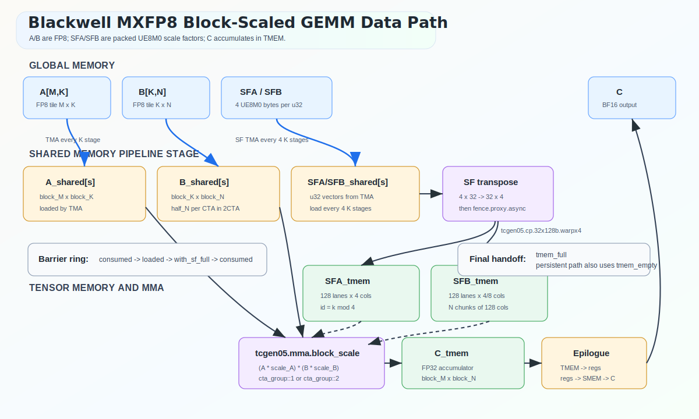
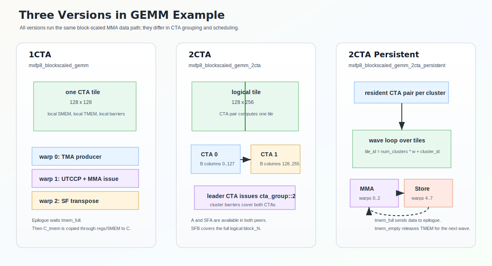
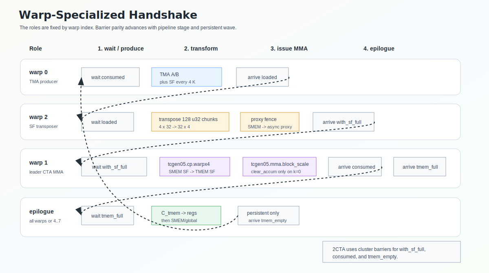
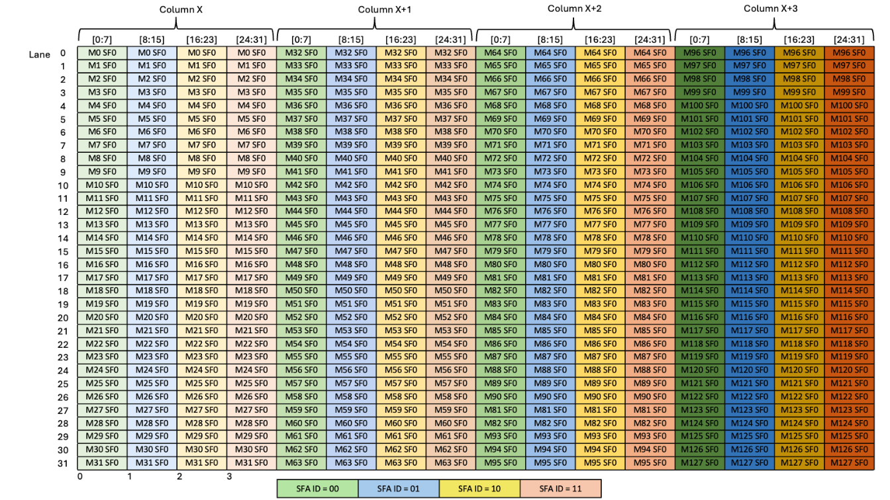
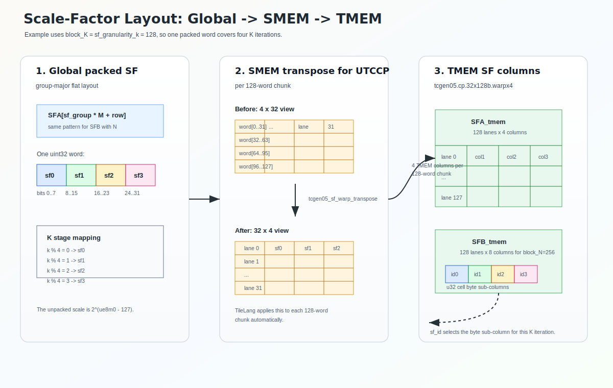

# SM100 MXFP8 Blockscaled Illustration

This note explains the Blackwell data path used by
[`gemm_mxfp8_blockscaled_1d1d.py`](gemm_mxfp8_blockscaled_1d1d.py) and the
grouped variants in
[`grouped_gemm_mxfp8_blockscaled_1d1d.py`](grouped_gemm_mxfp8_blockscaled_1d1d.py).
The kernels use 1D-1D MXFP8 block scaling: one `ue8m0` scale for each A row
and B column per 128 K elements. Four adjacent K scale blocks are packed into
one `uint32`.



## Kernel Variants



| Variant | Function | Launch shape | Tile ownership | Main difference |
| --- | --- | --- | --- | --- |
| 1CTA | `mxfp8_blockscaled_gemm` | `threads=128` | One CTA computes one logical `block_M x block_N` tile. | Local barriers. Warp 0 loads A/B/SF, warp 1 issues UTCCP and MMA, warp 2 transposes SF in SMEM. |
| 2CTA | `mxfp8_blockscaled_gemm_2cta` | `threads=128, cluster_dims=2` | A CTA pair computes one logical `128 x 256` tile. | Each peer loads a half-N B panel, A is loaded in both peers, and leader CTA issues `use_2cta=True`. |
| 2CTA persistent | `mxfp8_blockscaled_gemm_2cta_persistent` | `T.Kernel(sm_num, threads=256, cluster_dims=2)` | Resident CTA pairs walk logical tiles over multiple waves. | Adds a persistent scheduler and dedicated epilogue warpgroup, with `tmem_empty` handing TMEM back to the MMA warp. |

The grouped kernels reuse the same 2CTA and persistent structure. Their extra
work is scheduler-side: map `(pid_m, pid_n, eid)` through `offsets`, clamp tail
M blocks, and use `SFB[sf_group * E * N + eid * N + n]` for expert-local B
scales.

## Warp Specialization



The examples are warp-specialized by role, but they do not use the
`tcgen05.mma.ws` PTX form. The block-scaled call lowers to
`tcgen05.mma.cta_group::{1,2}.kind::mxf8f6f4.block_scale`; TileLang currently
rejects combining the block-scaled `.ws` variant with 2CTA.

| Threads | Non-persistent role | Persistent role | Main handoff |
| --- | --- | --- | --- |
| warp 0 | TMA producer for A, B, SFA, SFB | Same, inside the wave loop | Wait `consumed`, arrive `loaded`. |
| warp 1 in leader CTA | UTCCP copy plus `tcgen05.mma.block_scale` issue | Same, but waits `tmem_empty` before each wave | Wait `with_sf_full`, arrive `consumed`, finally arrive `tmem_full`. |
| warp 2 | SF transposer | Same | Wait `loaded`, transpose packed SF chunks, `fence_proxy_async`, arrive `with_sf_full`. |
| all warps / warps 4-7 | Copy `C_tmem` through registers/SMEM to global | Dedicated epilogue warpgroup | Wait `tmem_full`; persistent path arrives `tmem_empty` after reading TMEM. |

Two details are easy to miss:

- `tcgen05.mma` has single-thread issue semantics, so one elected lane in the
  MMA warp initiates the whole operation.
- `tcgen05.mma` and `tcgen05.cp` access SMEM through the async proxy. After the
  SF warp rewrites the SF buffer in normal SMEM, it uses `fence_proxy_async()`
  before the MMA warp uses `tcgen05.cp`.

## Scale-Factor Layout

Blackwell blockscaled tcgen05 MMA instructions require special layout for scale factors in TMEM. Take K=32, SFA as an example:


We need process like below to pack the scale factors into the required layout:



For `sf_granularity_k = block_K = 128`, the examples load one packed SF word
every four K iterations:

```text
sf_load_period = sf_granularity_k * 4 / block_K = 4
sf_k_blocks    = ceil(K / 128)
sf_k_groups    = ceil(sf_k_blocks / 4)
```

The global flat layout is group-major:

```text
SFA[sf_group * M + m]
SFB[sf_group * N + n]

word = sf0 | (sf1 << 8) | (sf2 << 16) | (sf3 << 24)
```

For grouped GEMM, SFA is still group-major over the concatenated M dimension,
while SFB is group-major over `(E, N)`:

```text
SFA[sf_group * M_total + m]
SFB[sf_group * E * N + eid * N + n]
```

Each SF TMA places a 1D `uint32` vector in SMEM:

- SFA has `block_M` words, one per output row.
- SFB has `block_N` words, one per output column.
- Each word contains four `ue8m0` bytes for four consecutive 128-wide K
  groups.

`T.tcgen05_sf_warp_transpose` works on each 128-word chunk. It rewrites a
`4 x 32` word view into a `32 x 4` word view, matching the
`tcgen05.cp.32x128b.warpx4` source pattern. `T.tcgen05_cp_warpx4` then copies
one 128-word chunk into four TMEM columns and duplicates it across the four
32-lane TMEM partitions required by block-scaled MMA, which is also required by hardware.

The resulting TMEM shapes in the 128x256 examples are:

```text
SFA_tmem: [128 lanes, 4 columns]
SFB_tmem: [128 lanes, 8 columns]  # two 128-column N chunks
```

During MMA issue, `sf_a_id = k % 4` and `sf_b_id = k % 4` select the active
byte sub-column from the packed `uint32` cell. This is why one SF TMA load
serves four adjacent `block_K=128` MMA iterations.

## Related

- TileLang kernels: [`gemm_mxfp8_blockscaled_1d1d.py`](gemm_mxfp8_blockscaled_1d1d.py)
- Grouped kernels: [`grouped_gemm_mxfp8_blockscaled_1d1d.py`](grouped_gemm_mxfp8_blockscaled_1d1d.py)
- TileLang helpers: `T.tcgen05_cp_warpx4`, `T.tcgen05_sf_warp_transpose`, and
  `T.tcgen05_gemm_blockscaled`
- PTX document: https://docs.nvidia.com/cuda/parallel-thread-execution/index.html#tcgen05-block-scaling
